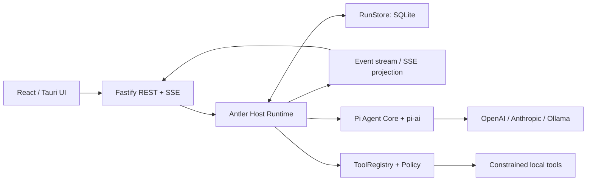
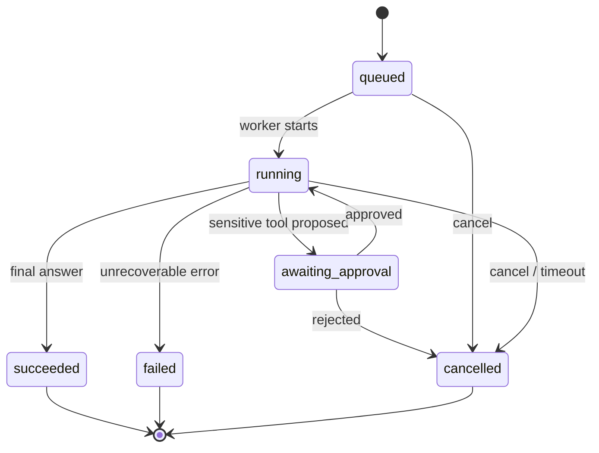

# AI Agent 项目架构规划

> 状态：**已收敛（第一版）**
> 已确认：Node.js 以本地伴生服务运行；前端与服务端采用 HTTP（REST）+ SSE 通信。

---

## 1. 项目定位

### 已确认：B 型（自主型 Agent）

项目以能调用工具、进行多步规划并执行任务的自主型 Agent 为核心。对话能力是其基础交互形态；架构需支持任务状态、工具调用和过程进度的流式反馈。

---

## 2. 技术栈总览（已定）

| 层 | 技术 | 说明 |
|---|---|---|
| 前端 | **Tauri 2 + React + TypeScript** | 桌面壳，可打包 mac/win/linux |
| UI | Tailwind CSS（建议） | 复用 React 生态 |
| 后端业务 | **Node.js 本地伴生服务** | 由 Tauri 拉起并随桌面应用生命周期运行 |
| 后端语言 | TypeScript（建议） | 与前端共享类型定义 |

---

## 3. 架构：Tauri 与 Node.js 的职责边界

### 已确认：Node.js 作为本地伴生服务

Node.js 与 Tauri 一起打包。应用启动时由 Tauri Rust 壳拉起服务，应用退出时负责回收；Node.js 承担业务 API、Agent 编排和 LLM 调用，Rust 保持薄，只处理系统级能力（进程管理、文件权限、托盘、通知等）。

该方案带来：
- 后端可独立测试（`node:test` / vitest），不依赖 GUI。
- 前后端通过统一的 HTTP + SSE 接口通信；如未来需要云端部署，可迁移服务部署位置而不改变主要协议。
- 默认仅监听 loopback 地址，并使用由 Tauri 注入的随机令牌或一次性会话令牌校验请求，避免本机其他进程访问服务。

---

## 4. 通信方式

### 已确认：HTTP（REST）+ SSE（流式推送）

- REST：会话/配置/CRUD
- SSE：LLM 流式输出、任务进度推送
- WebSocket 仅在需要客户端主动推大量事件时再引入（多数场景 SSE 足够）

```
Tauri（React）
   │  HTTP / SSE
   ▼
Node.js 本地伴生服务（业务 / Agent 编排 / LLM 调用）
   │
   ▼
LLM Providers (OpenAI / Anthropic / Ollama ...)
```

---

## 5. Monorepo 目录结构（建议）

```
antler/
├── docs/               # 规划与设计文档
├── app/                # Tauri + React 前端
│   ├── src/            # React 源码
│   ├── src-tauri/      # Rust 壳
│   └── package.json
├── backend/            # Node.js 后端
│   ├── src/
│   └── package.json
├── packages/           # 共享 (可选：类型、协议定义)
└── package.json        # 根 workspace
```

@ 用 pnpm workspace（或 npm workspaces）组织 monorepo，共享 TS 类型包 `packages/shared`。

---

## 6. 关键技术选型（@ 待确认）

| 关注点 | 建议 | 说明 |
|---|---|---|
| Agent / LLM SDK | Pi Agent Core + pi-ai | 状态化 tool loop、多 provider、流式 |
| 工具调用 | Function Calling / Tool use | 依赖具体 provider SDK |
| 数据库 | 本地 SQLite（better-sqlite3）/ 远端 PG | 取决于后端形态 |
| 会话存储 | SQLite + 向量（可选） | 记忆/检索增强 |
| 鉴权（若远端） | JWT + 中间件 | |
| 配置 | 环境变量 + dotenv | LLM key 管理 |

RAG 的本地存储、检索工具、索引版本和分阶段实施方案见：[Agent 后端 RAG 支持方案](./03-rag-backend-design.md)。

## 7. 后端 Agent 框架（已确认：第一版）

具体的分阶段实现、接口契约与验收标准见：[Pi Agent 后端实现计划](./02-pi-agent-implementation-plan.md)。

### 决策

采用 **Pi Agent Core + Antler Host Runtime**：

- 使用 `@earendil-works/pi-agent-core` 作为 Agent loop：管理对话上下文、流式模型调用与工具执行循环。
- `backend` 内保留薄的 `AntlerHostRuntime`，负责 run 生命周期、工具策略与审批、取消、SQLite 持久化，以及将 Pi 事件投影为稳定的 SSE 领域事件。
- 使用 Pi 自带的 `@earendil-works/pi-ai` provider/model 适配；不再引入 Vercel AI SDK。
- 不直接采用完整的 `pi-coding-agent`。它面向编码 Agent，包含默认 Bash/编辑工具、`~/.pi/agent` 配置发现和 JSONL 会话管理；这些默认行为不符合 Antler 的最小权限与 SQLite 记录边界。
- 不使用已弃用的 `@mariozechner/pi-agent-core` 包；包已迁移至 `@earendil-works` 命名空间。
- **暂不引入 LangChain、LangGraph 或 Mastra**。未来如需长期运行、可恢复的复杂 DAG/多 Agent 协作，仍可在 `AntlerHostRuntime` 内部评估图编排实现，HTTP/SSE 与持久化边界不变。

Pi 提供成熟的状态化 tool loop 与细粒度事件，Antler 则保留产品不可外包的行为（“能否做、做了什么、如何取消和恢复”）。这比维护一套自研 loop 更快落地，也不把桌面端安全模型交给 Pi 的默认编码工具。

### 运行时边界



| 模块 | 职责 | 不负责 |
|---|---|---|
| `PiAgentAdapter` | 创建 Pi session、调用 `prompt()`、订阅 Pi 事件 | HTTP、权限决策、业务持久化 |
| `AntlerHostRuntime` | run 生命周期、取消、限额、Pi 事件归一化 | provider SDK、通用 tool loop |
| `ToolRegistry` | 以 Pi Tool 适配器暴露 schema/执行器；权限级别、超时 | 模型选择、SSE 写入 |
| `RunStore` | run、step、消息与审批记录的持久化 | 运行中的业务逻辑 |
| SSE projection | 将领域事件转换为前端稳定事件 | 决策或状态持久化 |

### Run 状态与安全边界



第一版的强制约束：

- 一个 run 一个 `AbortController`；取消、客户端断开和总超时都必须传播到 Pi 的模型与工具调用。
- 每个 run 设定最大 step 数、最大工具调用数、总耗时与每工具超时，防止失控循环。
- 工具分为 `read`、`write`、`network`、`system` 四类；除 `read` 外默认要求前端显式审批。审批必须绑定本次 run、具体工具和参数摘要，不能作为永久授权。
- M3 不提供无限制 shell。先实现受工作区根目录约束的读/写文件与受 allowlist/超时限制的 HTTP；系统级能力仍经 Tauri/Rust 的显式接口暴露。
- 不将模型原始输出直接视为可信执行指令；即使 Pi 已做 tool schema 校验，Antler 仍须在执行器入口执行策略校验。

### 对外协议（v1）

保留现有 `POST /api/tasks`，但内部术语统一为 `run`；可在 M1 继续兼容 `taskId`，M2 起新增 `runId`。SSE 事件使用领域事件而非 provider 事件：

| 事件 | 最小载荷 | 用途 |
|---|---|---|
| `run.started` | `runId`, `status` | 已被 worker 接手 |
| `assistant.delta` | `runId`, `delta` | 流式文本 |
| `step.started` / `step.completed` | `runId`, `stepId`, `kind` | 展示推理/执行进度 |
| `tool.approval_required` | `runId`, `approvalId`, `tool`, `summary` | 前端弹出确认 |
| `tool.completed` | `runId`, `stepId`, `tool`, `summary` | 可审计的执行结果摘要 |
| `run.completed` / `run.failed` / `run.cancelled` | `runId`, `status` | 终态 |

客户端重连时从 `Last-Event-ID` 或 `afterEventId` 补放持久化事件，不能依赖仍在内存中的 SSE 连接。

### 推荐的目录增量

```
backend/src/
├── agent/
│   ├── pi-agent-adapter.ts # Pi session、prompt 与事件订阅
│   ├── host-runtime.ts     # run 生命周期与 Pi 事件映射
│   ├── tool-registry.ts    # Pi Tool schema + executor registry
│   ├── policy.ts           # 审批、路径与资源限制
│   └── events.ts           # 领域事件定义
├── services/run-service.ts
├── repositories/run-store.ts
└── routes/runs.ts
```

---

## 8. 建议实现阶段（Milestones）

以下阶段以已确认的本地伴生服务和 HTTP + SSE 链路为基础：

1. **M0 骨架**：✅ 已完成。初始化 monorepo + Tauri + React + Node 服务，打通 HTTP/SSE 最小链路，并实现 loopback + 会话令牌保护。
2. **M1 对话**：单会话流式对话，接入一个 LLM provider。
3. **M2 会话与运行记录**：SQLite 持久化、会话列表、run/事件补放、清空/删除。
4. **M3 受限工具调用**：Function Calling、路径受限读/写文件、受策略限制的 HTTP fetch、逐次审批。
5. **M4 Agent 编排**：Pi tool loop 接入、`AntlerHostRuntime` 状态机、取消、限额和进度推送。
6. **M5 打磨**：打包分发（dmg/nsis/deb/appimage）、错误处理、设置页。

---

## 9. 待你确认的问题清单

- [x] **Q1** Agent 定位：B 型（自主型 Agent）
- [x] **Q2** 后端形态：Node.js 本地伴生服务，由 Tauri 拉起和回收
- [x] **Q2.1** Agent 框架：Pi Agent Core + Antler Host Runtime
- [ ] **Q3** LLM provider 与模型（以及是否需多 provider 切换）
- [x] **Q4** 通信协议：HTTP（REST）+ SSE（流式推送）
- [ ] **Q5** 数据库选型（本地 SQLite / 远端 PG）
- [ ] **Q6** 是否需要用户系统/鉴权
- [ ] **Q7** 目标平台（mac 全都有？要不要 Windows/Linux）
- [ ] **Q8** 包管理器偏好（pnpm / npm / yarn）

---

## 10. 前置准备（待你确认后再做的安装）

- 安装 `@tauri-apps/cli`（当前未装）
- Rust 1.95 / Node 24 ✅ 已具备
- 初始化 Tauri 项目（`npm create tauri-app`）与 Node 服务骨架
