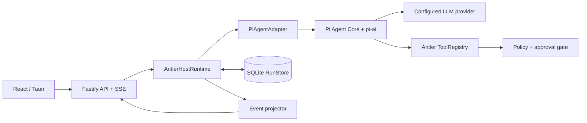
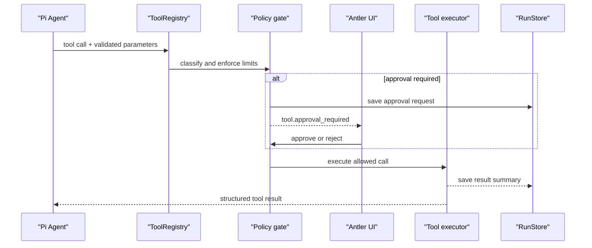

# Pi Agent 后端实现计划

> 状态：**待实施**  
> 依赖决策：[架构规划](./01-architecture-plan.md) 已确认使用 **Pi Agent Core + Antler Host Runtime**。

## 1. 目标与范围

将当前服务的占位式 SSE 输出替换为可安全运行的 Pi Agent：支持一次对话的流式回答、受策略控制的工具调用、取消以及可恢复的任务事件记录。

本计划使用 `@earendil-works/pi-agent-core` 和 `@earendil-works/pi-ai`；**不嵌入**完整 `pi-coding-agent`，不启用其默认 Bash/写文件工具，也不使用 `~/.pi/agent` 作为 Antler 的配置或会话存储。

本期不包含多 Agent、后台跨设备任务、无限制 shell 或远程用户系统。

## 2. 目标架构



| 层 | 负责 | 明确不负责 |
|---|---|---|
| Fastify routes | 请求校验、身份令牌、SSE 连接 | Agent 决策、工具执行 |
| `AntlerHostRuntime` | run 生命周期、并发限制、取消、持久化、领域事件 | Pi 的模型/tool loop |
| `PiAgentAdapter` | 创建和驱动 Pi 实例，映射 Pi event | HTTP、SQLite schema、授权规则 |
| `ToolRegistry` | 自定义 Pi tool 定义与执行器 | 直接信任模型参数 |
| `Policy` | 路径、网络、权限类别、审批、资源上限 | 模型 provider 选择 |
| `RunStore` | run、事件、审批和消息的持久化 | 运行中的内存状态 |

## 3. 关键设计

### 3.1 Pi 会话与并发

- 一个会话在任意时刻只允许一个 active run；新请求返回 `409 conversation_busy`，而不是向同一个 Pi 实例并发 `prompt()`。会话由请求中的 `conversationId` 标识（见 3.4）。
- 每个会话保存一个可重建的 Pi message history；进程重启时由 Antler SQLite 消息记录恢复，而非使用 Pi 的 JSONL session 文件。
- `PiAgentAdapter` 对外只暴露 `run(input, context, signal)`、`abort(runId)` 与 `restore(history)`；Pi 的类型和事件不泄漏到 route、UI 或数据库层。
- `AbortController` 是 run 的取消源。用户取消、窗口关闭、SSE 断开策略（可配置）和总超时都会触发 abort，并等待 Pi 停止后写入终态事件。
- Host Runtime 对每个 run 设置：最大 wall time、最大 tool-call 数、最大 event 数与单工具超时。超限时取消 run，不能由模型自行决定继续。

### 3.2 工具与审批

自定义工具通过 `ToolRegistry` 注册为 Pi tools，固定经历以下管线：



工具权限模型：

| 类别 | 第一版工具 | 默认策略 |
|---|---|---|
| `read` | 工作区内读取、目录枚举 | 允许，路径必须在工作区根目录下 |
| `write` | 创建或修改工作区文件 | 每次调用审批 |
| `network` | HTTP fetch | 每次调用审批；协议、主机 allowlist、超时和响应体大小限制 |
| `system` | shell、进程、系统设置 | M3 不实现；未来默认审批且独立风险评估 |

工具执行器必须在入口再次校验参数和策略；Pi 的 JSON schema 校验不能替代产品级安全校验。工具结果保存脱敏摘要，不能把密钥、完整二进制内容或超大响应写入 SSE/SQLite。

### 3.3 领域模型与事件

内部术语统一使用 `run`；M1 继续兼容当前 `/api/tasks` 与 `taskId`，并在响应中同时提供 `runId`。M2 后客户端迁移到 `/api/runs`。

| 实体 | 关键字段 |
|---|---|
| `conversations` | `id`, `title`, `created_at`, `updated_at` |
| `runs` | `id`, `conversation_id`, `status`, `input`, `started_at`, `finished_at`, `error_code` |
| `run_events` | `id`, `run_id`, `seq`, `type`, `payload_json`, `created_at` |
| `approvals` | `id`, `run_id`, `tool_name`, `parameter_summary`, `status`, `decided_at` |
| `messages` | `id`, `conversation_id`, `run_id`, `role`, `content_json`, `created_at` |

`run_events` 的 `(run_id, seq)` 必须唯一且单调递增。SSE 返回 `id: <seq>`，客户端用 `Last-Event-ID` 或 `afterEventId` 补放，因而断线重连不依赖进程内计时器。

事件 v1：

| 事件 | 载荷要点 |
|---|---|
| `run.started` | `runId`, `status` |
| `assistant.delta` | `runId`, `delta` |
| `step.started` / `step.completed` | `runId`, `stepId`, `kind` |
| `tool.approval_required` | `runId`, `approvalId`, `tool`, `summary` |
| `run.awaiting_approval` | `runId`, `approvalId`, `status` |
| `tool.completed` | `runId`, `stepId`, `tool`, `summary` |
| `run.completed` / `run.failed` / `run.cancelled` | `runId`, `status`, `error?` |

run 状态机一次到位：`queued -> running -> awaiting_approval -> running -> succeeded | failed | cancelled`。进入 `awaiting_approval` 时发出 `run.awaiting_approval`；审批通过后回到 `running`，拒绝则进入终态 `cancelled`（与[架构规划](./01-architecture-plan.md)一致）。审批等待期间总超时暂停计时，只累计实际运行时间，避免"用户审批慢导致整个 run 超时失败"。

不得把 Pi 的原始事件名作为对外协议；`PiAgentAdapter` 负责映射，避免 Pi 升级破坏 UI。

### 3.4 REST/SSE 契约

| 接口 | 行为 |
|---|---|
| `POST /api/tasks` | M1 兼容入口，body 为 `{ message, conversationId? }`（缺省时创建新会话）；返回 `taskId`、`runId`、`eventsUrl` |
| `POST /api/runs` | M2 正式创建入口，body 必须含 `conversationId`；返回 `202` 与 `runId` |
| `POST /api/conversations` | 创建会话，返回 `conversationId` |
| `GET /api/conversations` | 会话列表，含最后一条消息摘要与 `updated_at` |
| `GET /api/conversations/:id/messages` | 分页返回历史消息，用于 UI 回放与恢复 Pi 上下文 |
| `DELETE /api/conversations/:id` | 删除会话及其 runs、事件与审批记录（M2） |
| `GET /api/runs/:runId/events` | SSE 流或基于 `afterEventId` 补放事件 |
| `POST /api/runs/:runId/cancel` | 幂等取消 active run |
| `POST /api/approvals/:approvalId` | body 为 `{ decision: "approve" | "reject" }`；仅影响对应 run/tool call |

事件名的切换点：`/api/tasks` 兼容路由在下线前**始终输出旧事件名**（`task.started` / `message.delta` / `task.completed` / `task.failed`）；事件 v1 的新名称只出现在 `/api/runs/:runId/events`。现有前端仅解析 `message.delta`，因此两条路由的事件协议互不污染，前端迁移到 `/api/runs` 后再移除兼容路由。

所有接口延续 loopback + `x-antler-token` 保护。EventSource 场景可沿用受控的 query token；不得在日志、SSE payload 或持久化事件中回显令牌。

## 4. 实施阶段

### P0：兼容性 Spike（半天）

1. 在 `backend` 安装并锁定 Pi Core 与 pi-ai 版本；记录 Node 版本要求与选定 provider。
2. 建立最小 `PiAgentAdapter`：固定 system prompt、一个模型、无工具、单 prompt 流式输出。
3. 将 Pi text delta 映射为现有 SSE 占位事件，保留 `/health` 与本地令牌行为。
4. 编写一个真实 provider 的手工验收脚本；API key 仅来自环境变量，不写入仓库或 SQLite。

**完成标准：** UI 能收到真实模型逐 token 输出；未知/缺失 key 在兼容事件流上得到结构化 `task.failed`，服务不崩溃。

### P1：Host Runtime 与 run 生命周期（1 天）

1. 新增 `agent/pi-agent-adapter.ts` 与 `agent/host-runtime.ts`。
2. 用 `RunService` 替换当前 `TaskService` 的内存占位流程，保留 `tasks` 兼容 route。
3. 实现完整状态机 `queued -> running -> awaiting_approval -> running -> succeeded | failed | cancelled`（`awaiting_approval` 在 P3 接入审批后才可达，但状态与终态定义在此阶段一次定型），以及 abort、超时和单会话互斥。
4. 统一 Pi event 到领域事件的映射，并为每一种终态写一个单元测试。

**完成标准：** 取消不会继续输出 delta；每个 run 只有一个终态；同会话并发请求被明确拒绝。

### P2：SQLite 与可恢复 SSE（1–1.5 天）

1. 引入 SQLite driver 和 migration；实现 `RunStore` 与事务化的 `appendEvent()`。
2. 持久化 run、messages、events 与 approvals；读取历史时恢复 Pi 上下文。
3. 增加正式 `/api/runs` 与 `/api/conversations`（创建/列表/历史消息/删除）路由、事件补放与客户端重连处理。
4. 服务启动时将所有非终态 run 批量置为 `failed`（`error_code` 为 `server_restarted`）并补写终态事件，保证重启后不存在残留的 active run。
5. 添加进程重启后查询历史 run/补放事件的集成测试。

**完成标准：** 运行过程中断开并重连不丢失事件；服务重启后历史对话可继续，且没有停留在非终态的 run。

### P3：受限工具与审批（1.5–2 天）

1. 实现 `ToolRegistry`、`Policy` 与 approval coordinator。
2. 先注册只读工作区工具；实现真实路径规范化与符号链接逃逸检查。
3. 添加逐次审批的写文件工具和带 allowlist 的 HTTP fetch。
4. 将工具开始、审批和完成映射为 UI 事件并落库；测试拒绝、超时、取消和参数越界。

**完成标准：** 未审批的 `write`/`network` 不会执行；越过工作区的路径与未允许的主机均被拒绝且可审计。

### P4：产品化与回归（1 天）

1. 设置页实现 provider、模型、工作区和网络 allowlist 的配置；密钥存入操作系统安全存储，服务只接收临时可用配置。
2. 限制日志和事件中的敏感字段；添加崩溃恢复、错误文案、指标与 trace ID。
3. 对 Pi version 升级建立 adapter contract tests，防止内部事件变化影响 SSE。
4. 更新 README、打包说明和故障排查文档。

**完成标准：** 自动化检查覆盖关键状态迁移和策略拒绝；无 key、超时、取消、审批拒绝、服务重启均有可理解的 UI 结果。

## 5. 文件落点与依赖顺序

```
backend/src/
├── agent/
│   ├── pi-agent-adapter.ts
│   ├── host-runtime.ts
│   ├── tool-registry.ts
│   ├── policy.ts
│   └── events.ts
├── repositories/run-store.ts
├── services/run-service.ts
├── routes/runs.ts
└── routes/approvals.ts
```

依赖顺序：P0 先验证 Pi/provider；P1 建立可取消的内存 run；P2 再让状态与事件耐久化；P3 才开放有副作用的工具。这样不会在权限和恢复机制缺位时先暴露写入能力。

## 6. 风险与决策门

| 风险 | 应对 | 决策门 |
|---|---|---|
| Pi package/event API 快速演进 | 所有 Pi 类型隔离在 adapter；使用锁文件与 contract tests | P0 |
| Provider 密钥与本地数据泄露 | OS 安全存储、日志脱敏、最小权限工具 | P0/P4 |
| Pi 默认编码工具权限过大 | 仅注册 Antler custom tools，不引入 `pi-coding-agent` 内置工具集 | P3 前必须完成 |
| 断线造成任务失控 | 明确断线策略、run abort、SQLite 事件补放 | P1/P2 |
| 模型无限 tool loop | Host Runtime 独立计数、总超时和每工具超时 | P1/P3 |

开始 P0 前，唯一需要产品决策的是首个 provider/模型；建议优先选择一个云 provider，并在 P0 验证后再增加 Ollama。
