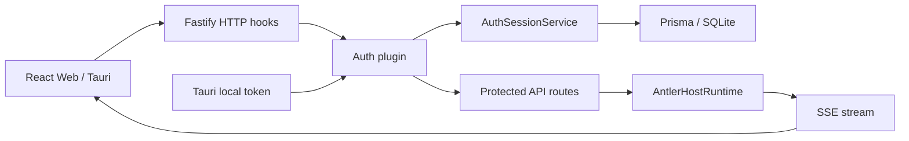
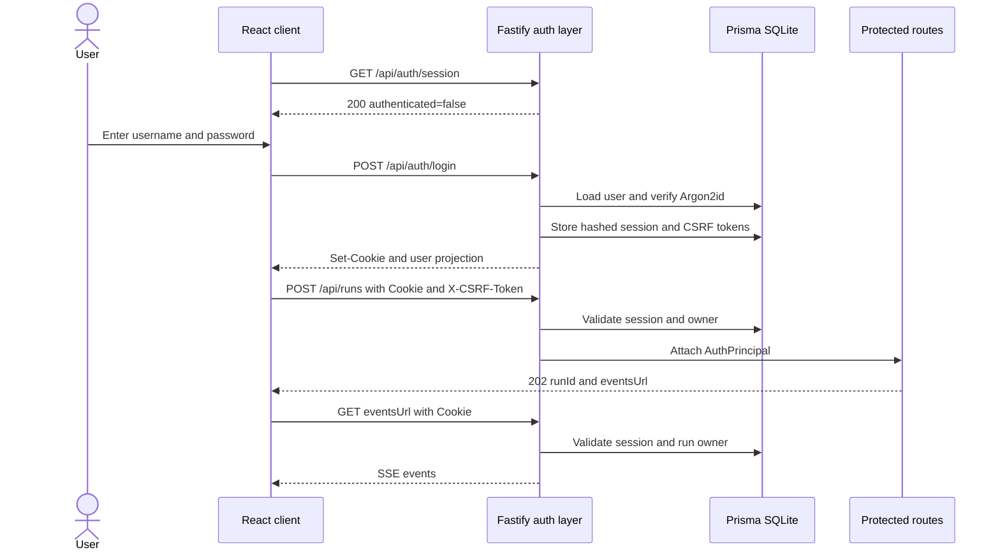

# Antler 登录认证功能规划

> 状态：**待评审**  
> 日期：2026-09-02  
> 适用范围：Tauri 本机模式与自托管 Web 模式  
> 相关文档：[AI Agent 项目架构规划](./01-architecture-plan.md)

## 1. 背景与结论

Antler 目前有两种不同的访问形态：

- Tauri 启动只监听 `127.0.0.1` 的伴生 Backend，并用一次性的 `ANTLER_ACCESS_TOKEN` 防止其他本机进程直接调用。
- Web 部署由 Fastify 同时提供静态页面、REST API 和 SSE；当前未配置 `ANTLER_ACCESS_TOKEN` 时，API 不需要用户登录即可访问。

现有 access token 是“客户端到本机伴生服务”的传输保护，不是用户身份。它没有账号、密码、服务端会话、退出登录、权限归属或登录审计语义，不能直接扩展成用户登录。

第一版采用以下结论：

1. 增加 `local` 与 `password` 两种认证模式，默认行为由部署形态明确决定，不能静默降级。
2. `local` 模式保留现有 Tauri/本机开发体验，不展示登录页，继续使用本机 access token。
3. `password` 模式提供一个管理员账号、用户名密码登录和服务端不透明会话，面向自托管 Web 部署。
4. 浏览器只保存 `HttpOnly` 会话 Cookie，不把 JWT、会话令牌或密码放进 `localStorage`、URL、React 状态持久化或日志。
5. 密码使用 Argon2id 哈希；会话使用高熵随机令牌，数据库只存令牌的 SHA-256 摘要。
6. 所有业务 API，包括 run 创建、SSE、取消、技能目录和本机目录浏览，都必须先得到认证主体。
7. 第一版是单管理员认证，不开放注册、邀请、找回密码、第三方登录或角色管理；数据模型为未来多用户预留所有者字段。

## 2. 现状与风险

### 2.1 当前实现

| 区域 | 当前实现 | 与登录认证的差距 |
|---|---|---|
| HTTP 入口 | `backend/src/plugins/http.ts` 检查 `x-antler-token` 或 URL `token` | 只判断共享令牌，不产生用户主体 |
| Tauri | Rust 启动 Backend 时生成进程级 token | 可继续作为本机传输凭证，但不能代表账号 |
| Web | 静态页面公开；未设置 access token 时 API 全部可用 | 公网部署缺少登录边界 |
| 数据库 | Prisma + SQLite，仅有 `Run`、`RunEvent` | 没有用户、密码摘要、会话和所有者 |
| 前端 | 单个 `App`，没有认证状态或 `/login` 路由 | 无法引导登录、处理会话过期或退出 |
| 项目/会话 | 保存在浏览器 IndexedDB | 登录不会自动带来跨端同步或浏览器间数据隔离 |
| Provider 密钥 | 可保存在浏览器 `localStorage` 并随 run 请求发送 | 退出登录不会自动清除已有本地密钥 |

### 2.2 需要优先关闭的风险

- 未登录调用 `/api/runs` 可以驱动模型、工具和工作区文件访问。
- 未登录调用 `/api/directories` 会暴露服务端目录结构。
- run ID 或 conversation ID 没有关联主体，后续多用户化时容易形成越权访问。
- 现有 CORS 返回 `Access-Control-Allow-Origin: *`；Cookie 登录不能继续使用通配 origin。
- SSE 查询参数中的 token 可能进入代理访问日志、浏览器历史或监控系统；Web 密码模式应改为 Cookie 认证。
- 仅在前端隐藏页面不构成保护，认证和对象所有权必须由 Backend 强制执行。

## 3. 目标与非目标

### 3.1 第一版目标

1. Web 部署支持管理员登录、查询当前会话、退出和修改密码。
2. 未认证请求无法访问任何业务 API 或 SSE 流。
3. 登录状态刷新页面后保持，会话过期或撤销后立即回到登录页。
4. 密码、会话令牌和 CSRF token 均按用途安全存储和比较。
5. 登录接口具备账号枚举防护、双维度限流和统一错误响应。
6. run 在创建、读取事件和取消时都绑定并校验认证主体。
7. 本机 Tauri 模式保持免登录和现有生命周期管理。
8. 配置错误时 fail closed；非 loopback 部署不能意外以无认证模式启动。

### 3.2 第一版非目标

- 用户自助注册、邮箱验证、邀请、组织、RBAC 或管理员后台。
- 忘记密码邮件、短信验证码、MFA、OAuth/OIDC/LDAP/SSO。
- 多用户共享同一个 workspace，或细粒度文件/工具权限。
- 把 IndexedDB 中的项目和会话迁移到服务端或跨设备同步。
- 对浏览器本地 Provider API Key 做服务端托管或加密。
- 多实例共享会话、Redis session store 或跨区域部署。

第一版不能对外宣称“多用户数据隔离”。退出登录会阻止 Backend 访问，但同一浏览器中已有的 IndexedDB 和 `localStorage` 数据仍属于本机数据；共享浏览器场景需要后续的数据迁移与本地清理策略。

## 4. 认证模式

```ts
type AuthMode = "local" | "password";

type AuthPrincipal =
  | { kind: "local"; scope: "local-owner" }
  | { kind: "user"; userId: string; sessionId: string; role: "admin" };
```

### 4.1 `local` 模式

- 只允许 `ANTLER_HOST` 为 loopback 地址。
- Tauri 设置 `ANTLER_ACCESS_TOKEN` 后，继续接受 `x-antler-token`；兼容期内 SSE 可接受查询参数 token。
- 本机浏览器开发可显式使用无 token 的 loopback `local` 模式。
- `/api/auth/session` 返回 `mode: "local"` 和一个本地主体，前端直接进入主界面。
- 不创建 `User` 或 `AuthSession` 数据。

### 4.2 `password` 模式

- 面向 Fastify 托管 Web 页面或受信反向代理后的部署。
- 静态资源、SPA fallback、`GET /health`、`GET /api/auth/session` 和 `POST /api/auth/login` 公开；其他 API 默认拒绝。
- 业务请求只接受服务端会话 Cookie，不接受 access token 绕过用户登录。
- 生产环境必须通过 HTTPS 暴露；Backend 可在反向代理后监听 HTTP，但必须正确配置受信代理和公共 origin。

### 4.3 启动校验

新增配置：

| 环境变量 | 含义 | 建议默认值 |
|---|---|---|
| `ANTLER_AUTH_MODE` | `local` 或 `password` | loopback 开发为 `local`；部署文件必须显式设置 |
| `ANTLER_PUBLIC_ORIGIN` | Web 唯一允许的 origin，如 `https://antler.example.com` | `password` 模式必填 |
| `ANTLER_SESSION_TTL_HOURS` | 会话绝对有效期 | `168`（7 天） |
| `ANTLER_SESSION_IDLE_HOURS` | 会话空闲有效期 | `24` |
| `ANTLER_BOOTSTRAP_USERNAME` | 首个管理员用户名 | `admin` |
| `ANTLER_BOOTSTRAP_PASSWORD_FILE` | 首次启动时只读密码文件 | `password` 且无用户时必填 |
| `ANTLER_TRUST_PROXY` | 明确的代理层数或可信代理配置 | 默认关闭 |

校验规则：

- `password` 模式缺少 public origin 时拒绝启动。
- 非 loopback host 使用 `local` 模式时拒绝启动。
- password file 只在数据库没有用户时读取；创建管理员后不再读取，也不能覆盖已有密码。
- 不接受明文 `ANTLER_BOOTSTRAP_PASSWORD` 作为长期配置，避免密码出现在进程环境、Compose 展开结果和诊断输出中。
- public origin 必须是规范化的单一 `http(s)` origin，不能包含路径、通配符或凭据。

## 5. 总体架构



职责拆分：

| 模块 | 负责 | 不负责 |
|---|---|---|
| HTTP plugin | CORS、公共 origin、安全响应头、请求 ID | 密码校验和业务授权 |
| Auth plugin | 解析认证方式、加载主体、保护路由、CSRF 校验 | 登录页面和 run 生命周期 |
| Password service | Argon2id 哈希、校验、参数升级 | 会话 Cookie |
| Session service | 创建、轮换、查询、撤销和过期清理 | 用户密码策略 |
| Auth routes | session/login/logout/change-password 契约 | 业务对象访问 |
| Protected routes | 要求 principal，校验对象所有者 | 自行解析 Cookie |
| React auth layer | 启动探测、登录表单、401 恢复、退出 | 作为最终安全边界 |

## 6. 数据模型

建议在 `backend/prisma/schema.prisma` 增加：

```prisma
enum UserRole {
  admin
}

enum UserStatus {
  active
  disabled
}

model User {
  id                 String        @id
  username           String
  normalizedUsername String        @unique
  displayName        String?
  passwordHash       String
  passwordChangedAt  DateTime      @default(now())
  role               UserRole      @default(admin)
  status             UserStatus    @default(active)
  createdAt          DateTime      @default(now())
  updatedAt          DateTime      @updatedAt
  lastLoginAt        DateTime?
  sessions           AuthSession[]
  runs               Run[]

  @@map("users")
}

model AuthSession {
  id             String   @id
  userId         String
  tokenHash      String   @unique
  csrfTokenHash  String
  createdAt      DateTime @default(now())
  lastSeenAt     DateTime @default(now())
  expiresAt      DateTime
  revokedAt      DateTime?
  userAgent      String?
  user           User     @relation(fields: [userId], references: [id], onDelete: Cascade)

  @@index([userId, expiresAt])
  @@index([expiresAt])
  @@map("auth_sessions")
}

model AuthAuditEvent {
  id         Int      @id @default(autoincrement())
  userId     String?
  type       String
  metadata   Json?
  occurredAt DateTime @default(now())

  @@index([occurredAt])
  @@index([userId, occurredAt])
  @@map("auth_audit_events")
}
```

`Run` 増加可空的 `ownerId` 与 `User` 关系。之所以迁移期允许空值：`local` 模式没有数据库用户，并且已有 run 需要兼容。进入 `password` 模式首次创建管理员时，在同一事务中把历史 `ownerId IS NULL` 的 run 归属给该管理员；此后密码模式创建的 run 必须有 owner。未来取消 local 模式或拆分本地 owner 后，再执行非空迁移。

约束与存储规则：

- `normalizedUsername` 采用明确、可测试的规范化规则；第一版建议只允许 ASCII 字母、数字、点、下划线和连字符，大小写不敏感。
- `passwordHash` 保存 Argon2id 编码字符串，包含算法、salt 和参数；不另存明文或可逆密文。
- session token 使用 CSPRNG 生成至少 256 bit，原值只进入 Cookie；数据库仅保存 SHA-256 摘要。
- CSRF token 独立生成，不能从 session token 推导；数据库保存其摘要。
- token 摘要比较使用 timing-safe compare。
- `userAgent` 截断长度并仅用于会话展示/审计；不把原始 IP 永久保存，必要时保存短期、带服务端密钥的 IP 摘要。
- 审计 metadata 使用白名单，绝不记录密码、Cookie、session token、CSRF token、Provider API Key 或完整请求体。

## 7. 密码与会话策略

### 7.1 密码

- 使用 Argon2id，最低参数不低于 OWASP 当前基线：19 MiB memory、2 iterations、parallelism 1；上线前在目标容器上基准测试，将单次验证控制在可接受延迟内。
- 每个密码由库生成独立 salt；不自行实现密码哈希格式。
- 长度为 12–128 个 Unicode code point，允许空格和所有可打印字符，不强制大小写/符号组合。
- 登录时如果发现旧参数低于当前策略，在验证成功后透明 rehash。
- 用户不存在时执行固定 dummy hash 校验，响应文案和大致耗时与密码错误一致，降低账号枚举风险。
- 修改密码需要当前密码；成功后撤销该用户全部 session，再签发一个新 session。

### 7.2 会话

- Cookie：`HttpOnly`、`SameSite=Lax`、`Path=/`、不设置 `Domain`；生产 HTTPS 使用 `Secure` 和 `__Host-` 前缀。
- 开发 HTTP 使用单独的非 `__Host-` cookie 名，禁止把开发配置带到生产。
- 绝对有效期默认 7 天，空闲有效期默认 24 小时；任一到期即撤销。
- `lastSeenAt` 最多每 5 分钟写一次，避免每个 SSE/轮询请求写 SQLite。
- 登录成功总是创建新 session，不能接受客户端给出的未知 session ID，避免 session fixation。
- 退出登录撤销当前 session 并清除 session/CSRF Cookie；密码修改、账号禁用撤销全部 session。
- 启动时及每天一次清理已过期或撤销超过 30 天的 session。

### 7.3 CSRF 与 CORS

- 修改状态的 Cookie 认证请求必须同时满足：origin 等于 `ANTLER_PUBLIC_ORIGIN`、JSON content type、`X-CSRF-Token` 与 CSRF Cookie/数据库摘要一致。
- 登录接口虽然尚无 session，也校验 origin 和 JSON content type，并执行严格限流。
- local token 请求不使用 Cookie，不走 Web CSRF 校验。
- password 模式不返回通配 CORS；同源生产不需要 CORS，Vite 开发仅允许配置中的精确 origin，并开启 credentials。
- `GET`、`HEAD` 不修改状态；logout 使用 `POST`。

### 7.4 登录防滥用

- 使用两个独立限流桶，而不是 `IP + username` 的组合桶：每 IP 限制总尝试量，每 normalized username 限制跨 IP 尝试量。
- 初始建议值：每 IP 15 分钟 30 次、每账号 15 分钟 10 次；达到阈值统一返回 429，并记录安全审计。
- 登录失败统一返回 `invalid_credentials`，不区分用户不存在、密码错误、账号禁用。
- 限流 key 在受信代理之后才使用 `request.ip`；未正确配置 `trustProxy` 时不得相信转发头。
- 依赖 `@fastify/rate-limit` 时锁定 Fastify 5 兼容且修复已知 IPv6 绕过问题的版本；账号维度仍由 Auth service 独立实现。

## 8. API 契约

所有认证响应添加 `Cache-Control: no-store`。错误体使用稳定 code，显示文案由前端本地化。

### 8.1 查询会话

`GET /api/auth/session`

```json
{
  "mode": "password",
  "authenticated": true,
  "user": {
    "id": "usr_...",
    "username": "admin",
    "displayName": "Administrator",
    "role": "admin"
  }
}
```

未登录仍返回 200：

```json
{ "mode": "password", "authenticated": false }
```

### 8.2 登录

`POST /api/auth/login`

```json
{ "username": "admin", "password": "..." }
```

- 200：设置 session 与 CSRF Cookie，返回用户投影。
- 400：`invalid_request`。
- 401：`invalid_credentials`。
- 429：`too_many_attempts`。

### 8.3 退出

`POST /api/auth/logout`

- 要求 session 与 CSRF。
- 无论 session 是否已被撤销，都清 Cookie 并返回 204，使操作幂等。

### 8.4 修改密码

`POST /api/auth/change-password`

```json
{ "currentPassword": "...", "newPassword": "..." }
```

- 204：修改成功、撤销旧 session 并在响应中设置新 session。
- 400：`invalid_request` 或 `password_policy_failed`。
- 401：`current_password_invalid` 或 `auth_required`。

### 8.5 业务 API 错误

| HTTP | code | 含义 |
|---:|---|---|
| 401 | `auth_required` | 无有效主体或 session 已过期 |
| 403 | `csrf_invalid` | Cookie 请求缺少或不匹配 CSRF token |
| 403 | `forbidden` | 主体无权访问该对象 |
| 429 | `too_many_attempts` | 登录限流 |

不要用 404 代替所有认证失败；在已经认证后的对象查询中，可用 404 隐藏其他所有者的对象是否存在。

## 9. 登录与业务请求流程

完整序列图源文件：[登录认证时序图](./diagrams/login-auth-sequence.mmd)。



## 10. Backend 改造设计

建议文件结构：

```text
backend/src/
├── auth/
│   ├── password-service.ts
│   ├── session-service.ts
│   ├── auth-service.ts
│   ├── auth-errors.ts
│   └── types.ts
├── plugins/
│   ├── http.ts
│   ├── auth.ts
│   └── database.ts
├── routes/
│   └── auth.ts
└── scripts/
    └── bootstrap-admin.ts
```

具体改动：

1. `config/env.ts` 解析并交叉校验 auth mode、public origin、session TTL、bootstrap file 与 trust proxy。
2. `plugins/http.ts` 只负责通用 HTTP 策略；移除 `antlerAuthorized` 这个布尔值，避免继续混淆传输授权和用户身份。
3. `plugins/auth.ts` 装饰 `request.authPrincipal`，集中维护公共路由 allowlist、session 解析和 CSRF hook。
4. `routes/auth.ts` 只调用 Auth service，不直接操作 Prisma 或密码库。
5. `createApp` 的注册顺序固定为：database → cookie/CORS → HTTP hooks → auth services/plugin → routes。
6. `registerRunRoutes`、`registerTaskRoutes`、`registerSkillRoutes` 和 `registerDirectoryRoutes` 从 request 取得 principal。
7. `AntlerHostRuntime` 的 run 记录增加 `actorScope`；事件订阅和取消必须同时匹配 run ID 与 actor scope，不能只在路由入口检查“已登录”。
8. 持久化 `Run.ownerId`，并在查询数据库事件时应用 owner 条件。
9. 健康检查保持公开，但只返回 `status`，不暴露 auth mode、用户名、数据库路径或配置状态。
10. 定义统一的 `AuthError` 到 HTTP 状态映射，未知错误不把内部消息返回客户端。

依赖建议：

- `@fastify/cookie`：Cookie 解析和序列化，必须在依赖 Cookie 的 `onRequest` hook 之前注册。
- 维护活跃、支持预编译产物的 Argon2id 库；选型时验证 macOS、Linux amd64/arm64 和 Docker 构建。
- `@fastify/rate-limit`：IP 维度限流；账号维度仍由认证服务实现，不能只依赖单个插件 key。

## 11. Frontend 改造设计

建议拆出：

```text
app/src/
├── auth/
│   ├── auth-provider.tsx
│   ├── auth-api.ts
│   ├── login-page.tsx
│   └── auth-types.ts
├── lib/
│   └── api-client.ts
└── main.tsx
```

行为要求：

1. `AuthProvider` 启动时调用 `/api/auth/session`，状态为 `loading | anonymous | authenticated | local`。
2. loading 期间显示轻量启动页，不先渲染 Chat，避免未认证业务请求闪现。
3. anonymous 显示 `/login`；登录成功后恢复原目标位置，密码字段立即清空。
4. `api-client.ts` 统一设置 base URL、`credentials: "include"`、local token、JSON header、CSRF header 和错误解码。
5. password 模式不再把 token 添加到 SSE URL；现有 fetch 流设置 `credentials: "include"`。
6. 任一业务请求收到 `auth_required` 时清除内存用户态并切到登录页；多个并发 401 只触发一次状态切换。
7. 设置页“个人资料”展示用户名、修改密码和退出登录；local 模式隐藏账号操作或标记“本机模式”。
8. 登出前取消活动 run；登出完成后卸载 Chat runtime，避免后台流继续消费。
9. 登录错误使用统一文案，不显示“用户不存在”。表单可访问，支持键盘提交和提交中禁用。
10. 第一版默认不删除 IndexedDB 会话和 Provider 配置，但退出对话框明确说明“本机数据仍保留”，并提供“同时清除此设备数据”的显式选项。

## 12. 安全响应头与日志

- 添加 CSP、`X-Content-Type-Options: nosniff`、合理的 `Referrer-Policy` 和 frame 限制；CSP 需先验证 Vite 构建与 Assistant Markdown 渲染。
- password 模式的 HTML 和 auth API 不缓存；带 hash 的静态资源继续长期缓存。
- 生产 Cookie 只有在识别为 HTTPS 公共 origin 时签发；配置不一致直接报启动错误。
- 登录成功/失败/限流、退出、密码修改、session 撤销写结构化审计事件。
- 日志过滤 `authorization`、`cookie`、`set-cookie`、`x-antler-token`、`x-csrf-token`、密码字段和 Provider key。
- 用户可见错误携带 request ID，服务端日志用 request ID 关联，不回显堆栈。

## 13. 实施阶段

### 阶段 A：认证基础与数据迁移

- 增加 auth 配置、启动校验和单元测试。
- 增加 Prisma 模型、迁移、管理员幂等 bootstrap。
- 实现 password/session/auth service、Cookie 和 CSRF。
- 实现认证 API、限流和 auth 集成测试。

完成标准：注入测试能够覆盖登录成功/失败、Cookie 属性、过期、撤销、CSRF、限流和启动 fail-closed。

### 阶段 B：业务路由与对象归属

- 替换 `antlerAuthorized`，为所有 API 接入 `AuthPrincipal`。
- 为 run/runtime/SSE/cancel 增加 actor scope 与 owner 校验。
- 校验技能、目录和任务兼容路由均不能匿名访问。
- 增加历史 run 归属迁移路径。

完成标准：匿名请求全部 401；用户不能凭猜测 ID 访问不属于其 scope 的 run 或事件。

### 阶段 C：前端登录体验

- 建立统一 API client 与 AuthProvider。
- 增加登录页、启动探测、401 恢复、退出和修改密码。
- Web SSE 改用 Cookie；local 模式保留 Tauri token。
- 增加组件和端到端行为测试。

完成标准：刷新保持登录、过期自动回登录、退出终止活动流，Tauri local 模式无回归。

### 阶段 D：部署加固与发布

- 更新 Docker/SSH 部署配置、secret file 示例和 README。
- HTTPS 反向代理环境验证 public origin、Secure Cookie 和 trust proxy。
- 增加审计清理、session 清理和运维手册。
- 先在测试环境验证，再对已有部署执行一次性管理员初始化。

完成标准：公网端口没有匿名业务能力，旧数据库可原地升级并可回滚应用版本。

## 14. 测试计划

### 14.1 Backend 单元测试

- 用户名规范化、密码边界、Argon2id verify/rehash。
- session token/CSRF token 生成、hash、到期和撤销。
- 配置组合：loopback local、非法远程 local、缺 public origin、错误 TTL。
- public route allowlist 不会因前缀匹配误放行，例如 `/api/auth/login-extra`。
- origin 规范化与代理头信任边界。

### 14.2 Backend 集成测试

- 登录设置正确 Cookie；响应和日志不含密码或原始 token。
- 未认证、伪造 Cookie、过期 session、禁用用户、错误 CSRF 的状态码。
- 登录失败不泄露账号存在性；IP/账号两个限流桶分别生效。
- logout 幂等；修改密码后旧 session 全部失效。
- `/api/runs`、events、cancel、skills、directories、tasks 的保护。
- run owner 不匹配返回 404，SSE 建连前完成 owner 校验。
- local/password 两种模式的回归矩阵。

### 14.3 Frontend 测试

- session loading 不渲染 Chat；anonymous 渲染登录页。
- 登录成功、错误、429、网络异常和重复提交。
- 业务 401 只触发一次登出转换。
- CSRF header 和 credentials 在修改请求中存在；GET 不误带密码信息。
- logout 取消 run、清认证内存态，并按用户选择保留或清除本机数据。
- local 模式不出现登录页。

### 14.4 发布验证

- Chrome/Safari、Tauri macOS、Docker amd64/arm64。
- 直连 HTTPS 与一层受信反向代理。
- Cookie 不出现在 URL、前端存储、应用日志和代理日志。
- SQLite 迁移前备份、迁移后旧 run 可访问、回滚脚本可用。

## 15. 验收标准

1. password 模式访问任意业务 API，未登录均返回 `401 auth_required`。
2. 正确凭据登录后刷新页面仍保持，Cookie 对 JavaScript 不可读。
3. 修改状态的 Cookie 请求缺少或伪造 CSRF token 时返回 403。
4. 退出、到期、修改密码或账号禁用后，旧 session 无法再次使用。
5. run 的创建、SSE 和取消使用同一 actor scope，越权 ID 不可访问。
6. 密码、原始 session token、CSRF token 和 Provider key 不写数据库日志或应用日志。
7. 非 loopback 部署无法以 local/no-auth 配置启动。
8. Tauri local 模式仍能创建、流式接收和取消 run，不要求用户登录。
9. `pnpm check`、`pnpm test` 全部通过，并增加认证关键路径覆盖。
10. 部署文档明确 HTTPS、管理员初始化、密码轮换、session 撤销和数据库备份步骤。

## 16. 发布与回滚

发布顺序：

1. 备份 `workspace/antler.db`。
2. 部署包含可空 `Run.ownerId` 的数据库迁移和兼容代码。
3. 在测试环境启用 `password`，通过登录与 run 冒烟测试。
4. 为生产挂载一次性 bootstrap password file，启动并确认管理员创建。
5. 删除或卸载 bootstrap secret，确认重启不再需要该文件。
6. 切换公网入口到 HTTPS，验证 Secure Cookie 后再开放流量。

回滚时可以回退应用，但不要直接删除用户/session 表或回滚已写入的数据迁移。若认证版本出现问题，优先关闭公网入口并恢复上一镜像；禁止为了可用性临时启用远程 local/no-auth。

## 17. 后续演进

只有在确认多用户需求后再进入第二阶段账号系统：

1. 把 Project、Conversation、Message 与 Provider credential 迁移到服务端，并全部增加 `ownerId`。
2. 增加邀请、用户管理、禁用、会话设备列表和管理员强制下线。
3. 引入 workspace membership 和工具权限，而不是仅按 user owner 判断。
4. 增加 MFA 或对接 OIDC/企业 SSO；届时本地密码可作为可选 fallback。
5. 多实例部署时把 session、限流和审计清理迁移到共享基础设施。

## 18. 待评审决策

| 决策 | 推荐项 | 影响 |
|---|---|---|
| 首期账号范围 | 单管理员 | 最快关闭公网匿名访问，不制造未完成的多用户隔离承诺 |
| Tauri 是否登录 | local 模式免登录 | 保持离线桌面体验；账号能力集中在 Web 部署 |
| 标识符 | username，不使用 email | 首期没有邮件能力，避免伪装成可找回账号 |
| 会话形态 | 数据库存储的不透明 Cookie session | 易撤销、易审计，不把长期 JWT 撤销问题带入首版 |
| 初始化方式 | 一次性只读 secret file | 兼容自动部署，同时减少明文密码长期驻留 |
| 本地数据退出策略 | 默认保留，可显式清除 | 避免意外丢数据，同时清楚声明共享设备限制 |

## 19. 安全依据

- [OWASP Password Storage Cheat Sheet](https://cheatsheetseries.owasp.org/cheatsheets/Password_Storage_Cheat_Sheet.html)
- [OWASP Session Management Cheat Sheet](https://cheatsheetseries.owasp.org/cheatsheets/Session_Management_Cheat_Sheet.html)
- [OWASP Authentication Cheat Sheet](https://cheatsheetseries.owasp.org/cheatsheets/Authentication_Cheat_Sheet.html)
- [OWASP CSRF Prevention Cheat Sheet](https://cheatsheetseries.owasp.org/cheatsheets/Cross-Site_Request_Forgery_Prevention_Cheat_Sheet.html)
- [OWASP Credential Stuffing Prevention Cheat Sheet](https://cheatsheetseries.owasp.org/cheatsheets/Credential_Stuffing_Prevention_Cheat_Sheet.html)
- [Fastify Cookie plugin](https://github.com/fastify/fastify-cookie)
- [Fastify Rate Limit plugin](https://github.com/fastify/fastify-rate-limit)

