# Workflow 支持设计与实施计划

> 状态：规划完成，前端展示框架待实施  
> 目标版本：Workflow v1  
> 依赖：[Pi Agent 后端实现计划](./02-pi-agent-implementation-plan.md)

## 1. 结论

Antler 的 workflow 应实现为一个独立的、持久化的编排层，而不是在现有聊天接口上拼接多个 prompt。Workflow 负责定义版本、DAG 校验、步骤调度、检查点、重试、取消和事件投影；Agent 节点通过受控接口复用现有 `AntlerHostRuntime`，不直接依赖 Pi Agent。

推荐按两个产品增量交付：

1. **MVP**：版本化 DAG、手动触发、Agent/条件/输出节点、单 workflow run 内串行调度、运行时间线、取消与失败步骤重试。
2. **v1.1**：审批节点、有限并行、定时/Webhook 触发、更多确定性节点。

在实现 workflow 前，必须先让现有 run 与事件真正落入 SQLite。当前 Prisma 已声明 `Run` 和 `RunEvent`，但运行时状态与事件仍保存在 `AntlerHostRuntime` 的 `Map` 中，前端会话保存在 IndexedDB；这不足以支撑 workflow 的恢复和审计。

## 2. 范围与假设

本文将 workflow 定义为：用户在项目内定义一张有向无环图，运行时把输入传给节点，按依赖和条件执行，并持久化每个步骤的输入、输出和状态。

### MVP 包含

- 一个 workflow 属于一个项目，使用前端现有 `projectId` 作为稳定关联键。
- 草稿可编辑；发布后生成不可变版本；run 永远绑定具体版本。
- 手动触发并传入结构化 JSON 输入。
- `agent`、`condition`、`output` 三类节点。
- DAG 支持分支与汇合，但同一个 workflow run 内先按稳定拓扑序串行执行。
- 全程持久化，支持 SSE 断线补放、取消、失败步骤重试和服务重启后的安全暂停。
- UI 提供 workflow 列表、表单式节点编辑器、校验结果和运行时间线。

### MVP 不包含

- 循环、递归子 workflow、动态生成节点。
- 任意 JavaScript、shell 或 SQL 节点。
- Cron、Webhook、文件变化等自动触发器。
- 多机 worker、分布式锁、高可用调度。
- 任意节点并行执行。
- 可自由拖拽的画布编辑器。

这些限制让第一版可以建立可靠的领域边界，同时避免把执行安全、表达式沙箱和复杂 UI 一次性耦合进来。

## 3. 当前项目基线

| 能力 | 当前实现 | 对 workflow 的影响 |
|---|---|---|
| Agent 执行 | `AntlerHostRuntime` 驱动 `PiAgentAdapter` | 可复用，但需要稳定的异步完成接口 |
| run 状态 | `queued/running/awaiting_approval/succeeded/failed/cancelled` | 可作为 Agent 子运行状态，不应与 workflow run 混用 |
| run/event 存储 | Prisma schema 已有表；运行时仍是内存 `Map` | 必须先接入 repository/store |
| SSE | 支持 `afterEventId`，事件只存在进程内 | 契约可复用，数据源需改为数据库事件日志 |
| 会话/项目 | 浏览器 IndexedDB | workflow 后端只能暂时保存不带 FK 的 `projectId` |
| 工具与 Skill | workspace tools、skill snapshot 已接入 Agent | Agent 节点应固定运行时快照以保证可复现性 |
| 前端 | 单页聊天壳 + 项目/会话侧栏 | 需要加入项目级 Workflow 入口与运行详情页 |

### 前后端技术栈

Workflow MVP 沿用项目现有的 TypeScript 全栈与本地优先架构，不额外引入独立工作流框架、消息队列或前端画布库。

#### 前端

| 层次 | 技术 | Workflow 中的用途 |
|---|---|---|
| 桌面容器 | Tauri 2、Rust | 打包桌面应用，复用本地后端与目录访问能力 |
| UI 框架 | React 18、TypeScript、Vite 8 | 实现 Workflow 列表、表单式编辑器和运行详情页 |
| 路由 | React Router 7 | 增加项目级 Workflow、编辑和运行详情路由 |
| 状态管理 | Zustand 5 | 保存编辑中的草稿、校验结果和未提交状态；服务端数据仍以 API 为准 |
| UI 与样式 | Tailwind CSS 4、Base UI、Radix UI、Lucide React | 复用现有组件风格构建节点表单、状态徽标、对话框和时间线 |
| Agent UI | Assistant UI React、Assistant UI Markdown、Remark GFM | 展示 Agent 节点的流式文本和 Markdown 输出 |
| 本地数据 | 浏览器 IndexedDB、localStorage | 延续项目/会话与 provider 配置存储；Workflow 定义和 run 不存于此处 |
| 测试 | Vitest、Testing Library、jsdom、V8 coverage | 覆盖 API client、事件 reducer、编辑器交互和运行时间线 |

#### 后端

| 层次 | 技术 | Workflow 中的用途 |
|---|---|---|
| 运行时与语言 | Node.js、TypeScript、ESM | 承载 API、调度器、执行器和恢复逻辑 |
| HTTP 服务 | Fastify 5、`@fastify/static` | 提供 REST/SSE 接口，并在生产环境托管前端静态资源 |
| 数据访问 | Prisma 7、`@prisma/adapter-better-sqlite3` | 实现 workflow、版本、run、step attempt 和事件 repository |
| 数据库 | SQLite、better-sqlite3 | 提供本地持久化、事务检查点、事件补放和单进程任务 claim |
| Agent 运行时 | Pi Agent Core、Pi AI、现有 `AntlerHostRuntime` | 通过 `AgentExecutionPort` 执行 Agent 节点并传播取消与结果 |
| 数据契约 | TypeScript discriminated union、TypeBox | 定义节点类型、请求载荷和运行时校验 schema |
| 实时传输 | 原生 SSE | 推送 workflow/step 事件，使用每个 run 单调递增的 `seq` 支持断线续传 |
| 测试 | Vitest、Fastify `inject`、内存 SQLite | 覆盖 validator、调度状态机、事务、API 与 SSE replay |

仓库继续使用 pnpm workspace 统一管理 `@antler/app` 与 `@antler/server`。MVP 的串行 worker 运行在 Fastify 进程内；只有在引入多机执行或显著提高并发后，才评估独立 worker 和外部队列。

### 必须先解决的技术债

1. Prisma `RunEvent.id` 是全局自增 ID，内存事件 ID 却是每个 run 从 1 开始。应增加 `seq` 并保证 `@@unique([runId, seq])`，SSE 的 `id` 使用 `seq`。
2. `AntlerHostRuntime` 只暴露创建、查询、订阅和取消，没有“等待终态并返回结构化结果”的稳定接口。Workflow 不应通过解析 SSE 驱动子 run。
3. `PiAgentAdapter` 的对话历史仅缓存在进程内，服务重启不能重建上下文。Workflow 的 Agent 节点第一版建议使用独立会话，并保存最终结构化输出。
4. workflow 与项目的关联先使用客户端产生的 `projectId`。若未来支持多设备或用户系统，应把 Project/Conversation 一并迁移到后端并建立外键。

## 4. 目标架构



源文件：[workflow-runtime-v1.mmd](./diagrams/workflow-runtime-v1.mmd)

| 组件 | 职责 |
|---|---|
| `WorkflowService` | CRUD、发布、触发、取消、重试，负责事务边界 |
| `WorkflowDefinitionValidator` | schema、引用、端口、环路、可达性和模板引用校验 |
| `WorkflowEngine` | claim run、计算 ready 节点、检查点、状态推进 |
| `NodeExecutorRegistry` | 按节点类型分发，隔离具体执行逻辑 |
| `AgentNodeExecutor` | 生成 prompt，创建 Agent run，等待终态，提取输出 |
| `WorkflowStore` | 定义、版本、run、step attempt 与事件持久化 |
| `WorkflowEventStream` | 先补放数据库事件，再订阅实时事件 |
| `StartupRecovery` | 把重启时正在执行的步骤标记为 interrupted，并暂停 run |

`WorkflowEngine` 只依赖一个面向领域的 Agent 执行端口，例如：

```ts
type AgentExecutionPort = {
  execute(request: AgentExecutionRequest, signal: AbortSignal): Promise<AgentExecutionResult>;
  cancel(runId: string): Promise<void>;
};
```

这样 Pi 的事件、模型类型和缓存策略不会泄漏到 workflow 层。

## 5. Workflow 定义

### 5.1 版本策略

- `Workflow` 保存身份、项目归属和当前草稿。
- 每次保存草稿递增 `revision`，PATCH 使用乐观锁避免多窗口覆盖。
- `publish` 对草稿做完整校验，并创建不可变 `WorkflowVersion`。
- 每个 `WorkflowRun` 固定引用 `workflowVersionId`；编辑或重新发布不影响历史 run。
- 删除默认使用软删除；已产生 run 的版本永不物理删除。

### 5.2 定义示例

```json
{
  "schemaVersion": 1,
  "inputs": {
    "topic": { "type": "string", "required": true }
  },
  "nodes": [
    {
      "id": "draft",
      "type": "agent",
      "config": {
        "prompt": "为 {{inputs.topic}} 生成一份技术方案",
        "skillPolicy": { "mode": "auto" }
      }
    },
    {
      "id": "has_content",
      "type": "condition",
      "config": {
        "left": "{{steps.draft.output.text}}",
        "operator": "not_empty"
      }
    },
    {
      "id": "result",
      "type": "output",
      "config": {
        "value": "{{steps.draft.output.text}}"
      }
    }
  ],
  "edges": [
    { "from": "draft", "to": "has_content" },
    { "from": "has_content", "port": "true", "to": "result" }
  ]
}
```

### 5.3 表达式与模板安全

- 只允许 `{{inputs.*}}`、`{{steps.<nodeId>.output.*}}` 和少量运行元数据引用。
- condition 使用固定操作符：`eq`、`neq`、`exists`、`not_empty`、`contains`、数值比较。
- 禁止 `eval`、`new Function`、任意属性原型访问和代码表达式。
- 发布时校验静态引用；运行时对缺失路径返回结构化 `template_binding_missing`。
- 节点输出设置大小上限；事件只保存摘要，大对象另存 step output 字段。

### 5.4 节点契约

| 节点 | 输入 | 输出 | 失败策略 |
|---|---|---|---|
| `agent` | prompt 模板、provider/model 可选覆盖、skill policy | `{ text, agentRunId, usage? }` | 可配置最多 2 次指数退避重试；默认不重试 |
| `condition` | 两侧值与固定 operator | `{ matched: boolean }` | 绑定或类型错误立即失败 |
| `output` | value 模板 | workflow 最终 JSON 输出 | 绑定错误立即失败 |

节点执行器必须声明 `retrySafe`。涉及写工具的 Agent run 不能自动重放；失败或重启后由用户确认再重试。

## 6. 数据模型

建议新增以下 Prisma 模型；字段名保持项目当前 camelCase 风格：

| 模型 | 关键字段与约束 |
|---|---|
| `Workflow` | `id`, `projectId`, `name`, `description?`, `draftDefinition`, `revision`, `publishedVersionId?`, `archivedAt?`, timestamps；索引 `(projectId, updatedAt)` |
| `WorkflowVersion` | `id`, `workflowId`, `version`, `definition`, `definitionHash`, `createdAt`；唯一 `(workflowId, version)` |
| `WorkflowRun` | `id`, `workflowId`, `workflowVersionId`, `status`, `input`, `output?`, `errorCode?`, `workingDirectory`, `createdAt`, `startedAt?`, `finishedAt?` |
| `WorkflowStepRun` | `id`, `workflowRunId`, `nodeId`, `attempt`, `status`, `input?`, `output?`, `agentRunId?`, `errorCode?`, timestamps；唯一 `(workflowRunId, nodeId, attempt)` |
| `WorkflowRunEvent` | `id`, `workflowRunId`, `seq`, `type`, `payload`, `createdAt`；唯一 `(workflowRunId, seq)` |

状态建议：

- Workflow run：`queued | running | paused | succeeded | failed | cancelled`。
- Step attempt：`pending | running | succeeded | failed | skipped | cancelled | interrupted`。

`WorkflowStepRun.agentRunId` 可选关联现有 `Run`。保留现有 `Run` 模型名以降低迁移风险，但在 TypeScript 领域层改名为 `AgentRun`，避免与 `WorkflowRun` 混淆。

事件追加与状态变更必须在同一个数据库事务中完成。`seq` 的分配在单写者事务内读取当前最大值并递增；SQLite MVP 不需要额外消息队列。

## 7. 执行与恢复语义



源文件：[workflow-run-state-v1.mmd](./diagrams/workflow-run-state-v1.mmd)

### 7.1 调度算法

1. 创建 run，保存输入与绑定版本，追加 `workflow.run.queued`。
2. worker 原子 claim 一个 queued run，状态改为 running。
3. 从已成功/跳过的 step 计算 ready 节点；按定义中的节点顺序稳定排序。
4. 在执行前创建 attempt 并提交 `step.started` 检查点。
5. executor 返回后，在同一事务保存 output、step 终态和事件。
6. condition 未命中的边对应下游标记为 skipped；汇合节点只有在所有有效前驱终态后才 ready。
7. output 节点成功后完成 workflow；无可运行节点但未完成时，以 `workflow_deadlock` 失败。

MVP 每个 workflow run 同时最多执行一个节点，服务级 worker 并发数通过配置限制。v1.1 再按 ready set 提供有限并行，并为汇合与取消补充竞态测试。

### 7.2 重启恢复

- 启动时扫描 `running` workflow run。
- 正在 `running` 的 step attempt 改为 `interrupted`，workflow run 改为 `paused`，追加恢复事件。
- 纯 condition/output 节点可由用户直接 resume。
- Agent 节点默认要求用户确认 retry，避免模型已经执行写操作后被自动重复执行。
- 已落库的成功节点不会重复执行。

### 7.3 取消与重试

- 取消是幂等操作；engine 先写 `cancelRequestedAt`，再 abort 当前 executor。
- 如果当前为 Agent 节点，调用 Agent execution port 的 cancel。
- 终态写入只有一个事务入口，避免同时收到完成和取消形成双终态。
- retry 创建新的 `WorkflowStepRun.attempt`，不覆盖失败记录；workflow run 从 failed/paused 回到 running。
- MVP 只允许“从失败节点继续”，不支持任意回退到历史节点。

## 8. API 与事件契约

### 8.1 REST

| 方法 | 路径 | 作用 |
|---|---|---|
| `GET` | `/api/projects/:projectId/workflows` | 列表 |
| `POST` | `/api/projects/:projectId/workflows` | 创建草稿 |
| `GET` | `/api/workflows/:workflowId` | 读取草稿、发布版本摘要 |
| `PATCH` | `/api/workflows/:workflowId` | 按 `revision` 更新草稿 |
| `POST` | `/api/workflows/:workflowId/validate` | 返回结构化诊断 |
| `POST` | `/api/workflows/:workflowId/publish` | 生成不可变版本 |
| `POST` | `/api/workflows/:workflowId/runs` | 触发已发布版本，返回 `202` |
| `GET` | `/api/workflow-runs/:runId` | 运行概要与步骤快照 |
| `GET` | `/api/workflow-runs/:runId/events` | SSE 补放与实时订阅 |
| `POST` | `/api/workflow-runs/:runId/cancel` | 幂等取消 |
| `POST` | `/api/workflow-runs/:runId/retry` | 从失败/中断步骤继续 |

创建 run 的输入建议：

```json
{
  "inputs": { "topic": "Antler workflow" },
  "workingDirectory": "/absolute/project/path",
  "provider": { "protocol": "openai-responses", "apiKey": "...", "model": "..." }
}
```

provider 密钥仅用于当前执行，不能写入 workflow 定义、run input、事件或日志。持久化时只保存 provider protocol/model/base URL 的脱敏快照。

### 8.2 事件

| 事件 | 核心载荷 |
|---|---|
| `workflow.run.queued` | `runId`, `workflowId`, `version` |
| `workflow.run.started` | `runId` |
| `workflow.step.started` | `runId`, `nodeId`, `attempt`, `nodeType` |
| `workflow.step.delta` | `runId`, `nodeId`, `delta`；仅 Agent 文本，允许合并/限流 |
| `workflow.step.completed` | `runId`, `nodeId`, `attempt`, `outputSummary` |
| `workflow.step.failed` | `runId`, `nodeId`, `attempt`, `error` |
| `workflow.step.skipped` | `runId`, `nodeId`, `reason` |
| `workflow.run.paused` | `runId`, `reason`, `nodeId?` |
| `workflow.run.completed` | `runId`, `output` |
| `workflow.run.failed` | `runId`, `error` |
| `workflow.run.cancelled` | `runId` |

客户端按 SSE `id: <seq>` 记录游标；重连携带 `Last-Event-ID` 或 `afterEventId`。大输出、完整 prompt、工具结果和密钥不得进入 SSE。

## 9. 前端方案

### 信息架构

- 项目侧栏增加 `Workflows` 入口，与 chat history 分区展示。
- Workflow 列表展示草稿/已发布、最近运行状态和最后更新时间。
- 编辑页采用三栏：节点列表、当前节点配置、校验/发布面板。
- 运行页显示顶部状态、输入/输出和按时间排序的 step timeline；Agent delta 可展开查看。

MVP 不做自由画布。表单式编辑器更容易支持键盘操作、schema 校验和稳定测试；底层定义仍是 DAG，之后可增加画布而无需改变后端协议。

### 9.1 展示框架先行

在 Workflow 后端 API 开发前，先交付一套只读为主、可切换页面状态的前端展示框架，用于确认信息架构、视觉层级和组件边界。该阶段使用类型安全的本地 fixture，不调用 Workflow API，不向 IndexedDB 或 localStorage 写入 Workflow 数据，也不承诺创建、保存、发布、运行等操作已经生效。

展示框架包含以下三个主视图：

| 视图 | 入口 | 展示内容 | 框架阶段允许的交互 |
|---|---|---|---|
| Workflow 列表 | 项目侧栏的 `Workflows` | 名称、说明、草稿/已发布状态、版本、节点数、最近运行和更新时间 | 搜索、状态筛选、进入编辑页、进入最近一次运行 |
| Workflow 编辑器 | 列表项或 `New workflow` | 节点列表、节点配置表单、输入定义、校验摘要、已发布版本 | 切换节点、编辑未持久化表单、切换诊断状态、打开测试运行预览 |
| Workflow 运行详情 | 列表最近运行或编辑器 `Test run` | run 状态、版本、输入、输出、step timeline、attempt 与错误摘要 | 展开步骤输入/输出、切换 attempt、返回定义页 |

框架阶段的按钮必须区分三类状态：

- 可演示：只改变当前页面内的展示状态，例如搜索、筛选、选择节点和展开步骤。
- 待接入：保存、发布、触发、取消和重试按钮可展示，但点击后只能给出“后端能力尚未接入”的明确提示。
- 不展示：导入/导出、归档和运行历史筛选等 W4 能力暂不进入首批框架，避免造成已实现的错觉。

### 9.2 页面布局

项目侧栏沿用现有项目与会话结构，在每个项目分组内增加独立的 `Workflows` 入口。进入 Workflow 后保留应用级侧栏和设置入口，主内容区替换聊天面板，不同时渲染聊天 runtime 和 Workflow 页面。

列表页：

```text
┌──────────────┬────────────────────────────────────────────────────┐
│ Project      │ Project name                         New workflow  │
│ ├ Workflows  │ Workflows                                          │
│ └ Threads    │ Search                         All Published Draft │
│              │ ┌────────────────────────────────────────────────┐ │
│              │ │ Name        Status      Last run      Updated │ │
│              │ │ Workflow A  Published   Succeeded     12m ago │ │
│              │ │ Workflow B  Draft       Not run       Yesterday│ │
│              │ └────────────────────────────────────────────────┘ │
└──────────────┴────────────────────────────────────────────────────┘
```

编辑页：

```text
┌──────────────┬──────────────────┬─────────────────────┬───────────────┐
│ App sidebar  │ Nodes            │ Node configuration  │ Validate      │
│              │ Workflow input   │ Name / ID           │ Diagnostics   │
│              │ 1. Agent         │ Type-specific form  │ Checklist     │
│              │ 2. Condition     │ Retry policy        │ Version       │
│              │ 3. Output        │ Edge / branch       │ Publish       │
└──────────────┴──────────────────┴─────────────────────┴───────────────┘
```

运行页：

```text
┌──────────────┬────────────────────────────────────────────────────┐
│ App sidebar  │ Status / run ID / version / actions               │
│              │ ┌──────────────────────┬─────────────────────────┐ │
│              │ │ Step timeline        │ Input                   │ │
│              │ │ ✓ Agent · attempt 1  │ Output                  │ │
│              │ │ ✓ Condition          │ Error / metadata        │ │
│              │ │ ✓ Output             │                         │ │
│              │ └──────────────────────┴─────────────────────────┘ │
└──────────────┴────────────────────────────────────────────────────┘
```

响应式规则：

- `>= 1200px`：编辑器完整三栏，运行页 timeline 与数据面板双栏。
- `800px–1199px`：编辑器隐藏右侧面板，通过顶部 `Validation` 抽屉打开；运行页仍可双栏。
- `< 800px`：节点列表改为下拉/抽屉，配置与运行信息单栏；保持所有状态和操作可通过键盘访问。

### 9.3 路由与页面状态

目标路由保持项目级语义：

| 路由 | 页面 |
|---|---|
| `/projects/:projectId/workflows` | Workflow 列表 |
| `/projects/:projectId/workflows/:workflowId` | Workflow 编辑器 |
| `/projects/:projectId/workflows/:workflowId/runs/:runId` | Workflow 运行详情 |

首批展示框架若受当前单页查询参数结构限制，可以暂时使用 `view=workflows`、`projectId`、`workflowId` 和 `runId` 表达相同状态，但组件内部不能依赖查询参数格式。路由适配应集中在页面入口层，避免后续迁移正式路径时改动列表、编辑器和运行详情组件。

页面刷新和浏览器前进/后退必须保留当前项目与主视图。fixture ID 使用固定值，确保展示链接可复现；不存在的 workflow/run 显示独立的 not-found 状态，不自动回退到第一个样例。

### 9.4 组件边界

```text
WorkflowEntry
├── WorkflowSidebarLink
└── WorkflowWorkspace
    ├── WorkflowListPage
    │   ├── WorkflowListToolbar
    │   ├── WorkflowTable
    │   └── WorkflowEmptyState
    ├── WorkflowEditorPage
    │   ├── WorkflowEditorHeader
    │   ├── WorkflowNodeList
    │   ├── WorkflowNodeForm
    │   └── WorkflowValidationPanel
    └── WorkflowRunPage
        ├── WorkflowRunHeader
        ├── WorkflowStepTimeline
        ├── WorkflowStepDetails
        └── WorkflowRunDataPanel
```

页面组件只消费 view model，不直接读取 fixture 或发起 HTTP 请求。数据源通过统一接口注入：

```ts
type WorkflowFrontendDataSource = {
  listWorkflows(projectId: string): Promise<WorkflowSummary[]>;
  getWorkflow(workflowId: string): Promise<WorkflowDetail>;
  getWorkflowRun(runId: string): Promise<WorkflowRunDetail>;
};
```

框架阶段实现 `FixtureWorkflowDataSource`；后端接口可用后增加 `ApiWorkflowDataSource`。两者返回相同 view model，使页面和交互测试无需随 API 接入重写。fixture 应覆盖 `draft`、`published`、`running`、`succeeded`、`failed`、`paused`、空列表和校验失败，且不得包含真实 provider key、工作目录或用户数据。

### 9.5 视觉与交互规范

- 复用现有 Antler 颜色变量、圆角、字体和 Lucide 图标，不在框架阶段引入新的 UI/画布依赖。
- Workflow 状态统一使用文字加颜色的 badge，不能只靠颜色区分；run 与 step 状态复用同一映射表。
- 节点类型使用固定图标和名称：`Agent`、`Condition`、`Output`；节点顺序必须有可读编号或连接线。
- 所有表单项有可见 label；诊断项应能定位到对应节点和字段；错误文案预留 error code 展示位置。
- 列表、编辑器和运行页分别提供 loading、empty、error、not-found 四类页面状态，避免 API 接入后再补整体布局。
- Agent 输出默认显示摘要，展开后再展示 Markdown；step delta 不进入列表页，防止高频更新造成重渲染。
- 框架页显式显示 `Preview` 或等价标识，直到真实 API 完成创建、保存和运行闭环。

### 9.6 展示框架验收标准

1. 用户能从任意项目分组进入该项目的 Workflow 列表，并通过浏览器返回回到原会话。
2. 列表、编辑器、运行详情三种视图可用固定 fixture 串联浏览，刷新后仍能恢复相同页面。
3. 编辑器可以切换三类节点并展示对应配置表单；校验成功和失败两种状态均可演示。
4. 运行详情同时展示成功、失败/暂停以及多 attempt 场景，step 详情可展开。
5. 所有未接后端的写操作都有一致的 preview 提示，不产生本地持久化副作用。
6. 在桌面、中等宽度和窄屏三档无水平页面溢出；键盘可访问所有导航与展开操作。
7. TypeScript 检查、组件测试和现有聊天测试通过；展示框架不改变聊天 runtime 的创建、会话保存和 provider 配置逻辑。

### 状态管理

- workflow 定义和 run 是服务端状态，通过独立 API client 获取，不写入 conversation IndexedDB。
- 编辑草稿可在 Zustand 中保存未提交变化；服务端 `revision` 冲突显示明确提示。
- SSE 只用于增量事件；页面首次加载必须先 GET run 快照，再从 `lastEventSeq` 接流，不能靠事件重建全部页面状态。
- Provider 配置沿用当前浏览器本地存储，只在触发 run 时提交。

## 10. 代码落点

```text
backend/src/
├── workflows/
│   ├── definition.ts
│   ├── validator.ts
│   ├── engine.ts
│   ├── events.ts
│   ├── node-executor.ts
│   └── executors/
│       ├── agent.ts
│       ├── condition.ts
│       └── output.ts
├── repositories/
│   ├── run-store.ts
│   └── workflow-store.ts
├── services/
│   └── workflow-service.ts
└── routes/
    └── workflows.ts

app/src/
├── features/workflows/
│   ├── api.ts
│   ├── data-source.ts
│   ├── fixtures.ts
│   ├── types.ts
│   ├── workflow-entry.tsx
│   ├── workflow-list.tsx
│   ├── workflow-editor.tsx
│   ├── node-form.tsx
│   ├── workflow-validation-panel.tsx
│   └── workflow-run.tsx
└── styles/
    └── workflow.css
```

`backend/src/app.ts` 只负责装配 store、engine、service 和 routes。路由不直接调用 Prisma，executor 不直接写 HTTP/SSE。

## 11. 实施阶段

### W0：持久化基础（1.5–2 天）

1. 实现 `RunStore`，把现有 Agent run 与事件接入 Prisma。
2. 为 `run_events` 增加每 run 单调 `seq`，统一 SSE replay 语义。
3. 为 Host Runtime 增加结构化完成结果与等待接口。
4. 启动时处理遗留 active Agent run，并补集成测试。

完成标准：服务重启后可查询旧 run 和补放事件；内存不再是事实来源。

### W1：定义、版本与校验（1.5–2 天）

1. 新增 workflow/version 表和 repository。
2. 定义 TypeScript discriminated union 与 JSON schema。
3. 实现 DAG、节点 ID、边、模板引用、输入 schema 校验。
4. 实现草稿 CRUD、乐观锁、validate 和 publish API。

完成标准：无效图不能发布；发布版本不可修改；历史版本可读取。

### W2：执行引擎（2.5–3.5 天）

1. 新增 workflow run/step/event 表与事务 API。
2. 实现单进程 worker、稳定拓扑调度和三个 MVP executor。
3. Agent executor 接入现有 runtime；传播取消与受限 delta。
4. 实现失败、跳过、输出、重启暂停与手工 retry。

完成标准：一张包含 Agent + 条件分支 + 输出的图可端到端运行；成功节点不会因重启或重试重复执行。

### W3：API/SSE 与前端运行页（2–3 天）

1. 完成触发、详情、事件、取消、重试接口。
2. 实现数据库补放 + 内存通知的 SSE event stream。
3. 将展示框架的数据源从 fixture 切换为 API，接通触发表单和实时运行时间线。
4. 覆盖断线重连、页面刷新和错误文案。

完成标准：刷新页面不丢进度；断线重连无重复/缺失事件；取消最终收敛到单一终态。

### WF0：前端展示框架（1–1.5 天，可在 W0–W2 期间并行）

1. 增加项目级 Workflow 入口和三种页面壳，接入正式路由或等价的集中式临时路由适配。
2. 定义前端 view model、data source 接口和覆盖关键状态的 fixture。
3. 完成列表、三栏编辑器和运行时间线的响应式展示与页面内演示交互。
4. 为未接入的写操作增加统一 preview 提示，补 loading/empty/error/not-found 状态。
5. 增加组件测试和三档宽度视觉检查，不修改聊天 runtime 或 Workflow 后端。

完成标准：无需后端即可完整浏览并评审 Workflow 信息架构；移除 fixture、接入 API 时不需要重写页面组件。

### W4：编辑器与产品化（2–3 天）

1. 实现节点/边表单编辑、实时诊断、发布确认。
2. 加入定义导入/导出、归档、运行历史。
3. 增加输出截断、敏感字段脱敏、保留策略和可观测日志。
4. 更新 README 和用户操作文档。

完成标准：用户不编辑原始 JSON 也能创建、发布和运行 MVP workflow。

后端与完整 MVP 功能预计 **7.5–10.5 个工程日**；WF0 另需 **1–1.5 个工程日**，可与 W0–W2 并行，因此不必等量增加整体日历工期。估算不含自由画布、审批系统和自动触发器。

## 12. 测试策略

### 单元测试

- Validator：环、自环、重复 ID、悬空边、不可达节点、错误模板引用。
- Scheduler：线性、分支、汇合、skip 传播、稳定顺序、deadlock。
- Executors：绑定、类型错误、abort、输出大小限制。
- 状态机：所有非法迁移、取消/完成竞态、retry attempt 递增。

### Repository/事务测试

- 发布版本号并发唯一。
- step 状态与 event 原子提交。
- `(workflowRunId, seq)` 单调且唯一。
- claim 同一个 run 只能成功一次。

### API 集成测试

- 使用 Fastify `inject` 和内存 SQLite，延续现有测试风格。
- 覆盖创建、revision 冲突、发布校验、触发、取消、重试和 404/409。
- SSE 覆盖首次连接、`afterEventId` 补放、终态自动关闭。

### 前端测试

- API client 和事件 reducer 使用 Vitest。
- 编辑器验证错误、未保存提示、发布按钮状态使用 Testing Library。
- run timeline 覆盖快照 + 增量合并、重复事件去重、重连。

### 关键端到端场景

1. 正常分支成功并得到 output。
2. Agent 节点失败后重试成功，保留两个 attempt。
3. 运行中取消，Agent 子 run 同步停止。
4. SSE 断开后从 seq 补放，无缺失和重复 UI 项。
5. 服务在 Agent 节点运行时重启，run 变为 paused，不自动重复副作用。
6. workflow 发布新版本后，旧 run 仍使用原定义。

## 13. 风险与决策门

| 风险 | 处理 | 决策点 |
|---|---|---|
| Agent 工具有副作用，自动重试导致重复执行 | 默认人工 retry；后续引入 idempotency key | W2 前 |
| 项目仅存在 IndexedDB，后端无 Project 外键 | MVP 保存 opaque `projectId`；多设备前迁移项目模型 | W1 前 |
| provider key 随触发请求传入，暂停后不可恢复 | 不持久化 key；恢复时要求客户端重新提交凭据 | W2 前 |
| Agent delta 事件量大 | 50–100ms 合并写入，设置总量与单 payload 上限 | W2 |
| SQLite 单写者竞争 | 短事务、禁止在事务内调用模型；并发度配置化 | W2 |
| workflow 定义未来需要画布能力 | 后端使用节点/边 DAG；MVP UI 不限制未来表达 | W4 |

## 14. 建议的后续扩展顺序

1. 审批节点和 `awaiting_approval` 状态。
2. bounded parallelism 与节点级并发策略。
3. 定时触发和签名 Webhook。
4. HTTP/文件/结构化转换等确定性节点。
5. 子 workflow、补偿步骤和幂等键。
6. 可视化画布、多机 worker 与远端队列。

不建议在前两个增量中引入循环和任意脚本节点：两者会显著扩大终止性、资源限制和安全边界。

## 15. 开工顺序

第一批 PR 建议严格拆为：

1. `Workflow frontend display framework + fixtures`（只做展示框架，可与后端 W0–W2 并行）
2. `RunStore + run_events.seq + replay tests`
3. `Workflow schema + validator + publish API`
4. `WorkflowEngine + deterministic executors`
5. `Workflow run API + SSE + recovery`
6. `Workflow UI data source: fixtures -> API`
7. `Workflow editor write actions + docs`

每个 PR 都应保持 `pnpm check` 与 `pnpm test` 通过，数据库变更独立 migration，避免 schema、引擎与大规模 UI 在同一提交中同时落地。
