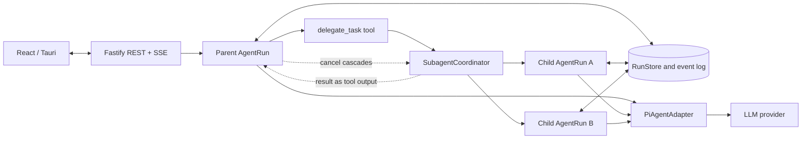

# Subagent 支持设计与实施计划

> 状态：规划完成，待实施  
> 目标版本：Subagent v1  
> 依赖：[Pi Agent 后端实现计划](./02-pi-agent-implementation-plan.md)

## 1. 结论

Antler 首版 subagent 应实现为 **Host Runtime 管理的受控委派工具**，而不是让 Pi Agent 自由创建进程，也不应复用父 Agent 的 conversation session。

主 Agent 通过 `delegate_task` 提交一个边界清晰的任务；`SubagentCoordinator` 创建独立的 child `AgentRun`，应用深度、数量、并发、超时和工具权限限制，完成后把结构化结果作为 tool result 返回主 Agent。Pi Core 现有的并行 tool execution 可让模型在同一轮发出多个 `delegate_task` 调用，从而并行执行彼此独立的子任务。

推荐分两次交付：

1. **后端 v1**：持久化父子 run、单层 subagent、最多 3 个并行 child、只读工具、父子事件、级联取消和 SSE 补放。
2. **产品 v1**：子任务 UI、崩溃后的可审计终态；审批后的受控写入和可配置 Agent profile 作为后续增强。

首版不做无限递归、subagent 之间直接通信、后台游离任务、跨机器执行和共享工作区并发写入。

## 2. 当前基线与主要缺口

| 现状 | 对 subagent 的影响 | 需要的调整 |
|---|---|---|
| `AntlerHostRuntime` 用 `activeConversations` 限制单会话单 active run | child 若复用 conversation 会被 `conversation_busy` 拒绝 | 只锁顶层用户 run；child 使用独立 execution session |
| `PiAgentAdapter` 按 `conversationId` 缓存 Agent | child 会污染父对话历史，多个 child 也会互相污染 | 显式传入 `sessionId` 与 history policy |
| 工具在 `PiAgentAdapter.tools()` 内静态创建 | delegation tool 无法安全回调 Host Runtime | 抽出 `ToolSetFactory`，通过窄接口注入 coordinator |
| run/event 仍主要保存在内存 `Map` | 无法可靠审计、重连或恢复父子运行 | v1 前接入现有 Prisma `Run`/`RunEvent` 表 |
| 取消只 abort 当前 run | parent 取消后 child 仍可能继续执行 | 建立 run tree，执行级联 abort 并等待收敛 |
| 工作区工具包含 `write`、`edit` 和 `bash` | 并行 child 可能互相覆盖文件或执行高风险命令 | MVP child 仅开放 `read` 与明确允许的检索工具 |
| SSE 只有扁平 run 事件 | UI 无法展示委派树和 child 进度 | 新增 subagent 生命周期事件和 children 查询 |

此外，当前 Prisma schema 虽已声明 `Run`/`RunEvent`，但 `AntlerHostRuntime` 尚未使用数据库；`RunEvent.id` 还是全局自增，而内存事件 ID 是每个 run 从 1 开始。持久化阶段需增加每个 run 单调递增的 `seq`。

## 3. 目标架构



源文件：[subagent-runtime-v1.mmd](./diagrams/subagent-runtime-v1.mmd)

| 组件 | 职责 |
|---|---|
| `AntlerHostRuntime` | 顶层 run 生命周期、父子树索引、终态收敛、事件投影 |
| `SubagentCoordinator` | 创建 child、配额校验、并发槽、级联取消、结果归一化 |
| `AgentRunExecutor` | 执行单个 AgentRun 并返回结构化结果；顶层与 child 共用 |
| `ToolSetFactory` | 按 Agent profile 构造工具；只向允许委派的 Agent 注入 `delegate_task` |
| `PiAgentAdapter` | 创建隔离的 Pi session、驱动 tool loop、映射 Pi 事件 |
| `RunStore` | 持久化 run、父子关系、事件、最终结果和 usage |
| SSE projector | 父 run 输出委派摘要；child run 保留自己的完整事件流 |

依赖方向必须保持为：`Pi tool -> SubagentPort -> Coordinator -> AgentRunExecutor -> PiAgentAdapter`。`PiAgentAdapter` 不应直接依赖 `AntlerHostRuntime`，避免运行时与工具注册形成循环依赖。

## 4. 运行语义

### 4.1 委派工具

MVP 工具契约：

```ts
type DelegateTaskInput = {
  task: string;
  label?: string;
  expectedOutput?: string;
};

type DelegateTaskResult = {
  childRunId: string;
  status: "succeeded" | "failed" | "cancelled";
  output?: string;
  error?: { code: string; message: string };
};
```

- `task` 必须自包含；child 不自动继承父 Agent 的完整 message history。
- Host 注入一段最小上下文：工作区根目录、父任务摘要、允许的工具、输出要求和资源上限。
- `output` 设置长度上限；完整 child transcript 留在 child run 中，父 Agent 只收到足以继续推理的结果。
- child 失败作为结构化 tool error 返回，主 Agent可降级、重试或解释；不能自动让整个 parent run 失败。
- 模型若要并行，应在同一个 assistant turn 中发出多个 `delegate_task` tool call。Pi Core 默认会并行执行这些调用，Coordinator 再施加全局并发上限。

### 4.2 会话与上下文隔离

将现在含混的 `conversationId` 拆成两个概念：

- `conversationId`：产品层归属，父 child 可相同，用于查询与审计。
- `sessionId`：Pi message history 隔离键。顶层可使用稳定的 conversation session；每个 child 使用自己的 `run.id`。

建议把 Adapter 接口改为：

```ts
type AgentExecutionRequest = {
  runId: string;
  sessionId: string;
  input: string;
  profile: "primary" | "subagent-readonly";
  skillSnapshot: SkillSnapshot;
  provider: ProviderRunConfig;
};

type AgentExecutionResult = {
  finalText: string;
  messages: AgentMessage[];
  usage?: { inputTokens?: number; outputTokens?: number };
};
```

不要让 child 写回父 Agent 的 Pi history。child 的最终结果只能通过 `delegate_task` 的 tool result 进入父上下文，这样上下文边界清晰，也便于压缩和审计。

### 4.3 父子生命周期

- child 是正式的 `AgentRun`，拥有独立 ID、状态、事件和 controller。
- parent 在等待 delegation tool 时仍保持 `running`；不新增 `waiting_for_subagent` 状态，避免状态机膨胀。
- parent 成功前，所有已创建 child 必须处于终态，不允许 orphan run。
- 用户取消 parent 时，Coordinator 先标记 cancel requested，再 abort 全部非终态 descendants，最后结束 parent。
- 单独取消 child 只让对应 tool call 返回 cancelled；是否继续由 parent Agent 决定。
- parent 的 wall-clock deadline 是根 deadline；child deadline 不得超过根 deadline。
- SSE 断开不取消 run，保持与当前实现一致；显式 cancel 才触发级联取消。

### 4.4 配额与默认值

| 限制 | MVP 默认值 | 说明 |
|---|---:|---|
| 最大深度 | 1 | child 不获得 `delegate_task`，从结构上禁止递归 |
| 每个 parent 最大 child 数 | 4 | 包含失败和取消的尝试 |
| 每个 parent 并行 child 数 | 3 | 超出的调用在 Coordinator 内排队 |
| 全服务并行 child 数 | 6 | 防止多个会话耗尽本机/provider 配额 |
| 单 child wall time | 120 秒 | 同时受 root deadline 约束 |
| child 输出返回父级 | 32 KiB | 超出时截断并给出 childRunId |
| child 事件数 | 5,000 | 独立于 parent 事件预算 |

限制必须由 Host/Coordinator 强制执行，不能只写进 system prompt。达到配额时返回 `subagent_limit_exceeded`、`subagent_timeout` 等稳定错误码。

## 5. 权限与并发安全

MVP 的 `subagent-readonly` profile 只包含：

- 工作区内 `read`；
- `load_skill` / `read_skill_resource`，沿用父 run 固定的 skill snapshot；
- 已配置时的网络搜索，但仍需沿用主 Agent 的网络策略。

明确排除 `write`、`edit`、`bash` 和再次委派。原因是多个 child 共享同一工作区，当前项目还没有审批协调器、文件 mutation lock 或隔离 worktree。

v1 若开放写入，必须先同时具备：

1. 每次调用审批，审批记录绑定 childRunId、工具和参数摘要；
2. 工作区级 mutation queue，至少按规范化文件路径串行；
3. 冲突检测或独立 worktree，禁止静默 last-write-wins；
4. parent 取消时工具能响应同一棵 abort tree；
5. 事件与日志脱敏，不把完整文件内容复制进 parent SSE。

## 6. 数据模型与事件

### 6.1 `Run` 增量

在现有 Prisma `Run` 上增加：

| 字段 | 类型 | 用途 |
|---|---|---|
| `kind` | `primary | subagent` | 区分用户 run 与 child run |
| `parentRunId` | `String?` | 直接父 run，自关联 |
| `rootRunId` | `String` | 快速查询整棵运行树 |
| `depth` | `Int` | 强制递归深度 |
| `label` | `String?` | UI 展示的短名称 |
| `result` | `Json?` | 结构化终态结果/摘要 |
| `cancelRequestedAt` | `DateTime?` | 解决完成与取消竞态 |

约束与索引：

- `@@index([parentRunId, createdAt])`
- `@@index([rootRunId, createdAt])`
- root run 的 `parentRunId = null`、`depth = 0`、`rootRunId = id`
- child 的 `depth = parent.depth + 1`，由 service 写入，不接受模型参数覆盖

`RunEvent` 增加 `seq` 与 `@@unique([runId, seq])`；SSE 的 `id` 使用 `seq`，数据库自增 `id` 只作内部主键。

### 6.2 领域事件

父 run 事件新增：

| 事件 | 最小载荷 |
|---|---|
| `subagent.created` | `runId`, `childRunId`, `label`, `depth` |
| `subagent.started` | `runId`, `childRunId` |
| `subagent.completed` | `runId`, `childRunId`, `summary` |
| `subagent.failed` | `runId`, `childRunId`, `error` |
| `subagent.cancelled` | `runId`, `childRunId`, `reason` |

child 自己继续使用现有 `run.started`、`assistant.delta`、`step.*`、`tool.completed` 和 run 终态事件。父 SSE 不转发 child 的逐 token delta，只投影生命周期摘要，以免事件量成倍增长；UI 展开 child 时连接该 child 的事件流。

### 6.3 API

| 方法 | 路径 | 行为 |
|---|---|---|
| `GET` | `/api/runs/:runId` | 返回 run 概要及 parent/root 标识 |
| `GET` | `/api/runs/:runId/children` | 返回直接 children；可选 `recursive=true` |
| `GET` | `/api/runs/:runId/events` | 沿用现有 child 独立事件流 |
| `POST` | `/api/runs/:runId/cancel` | 对 root 级联取消；对 child 只取消该子树 |

不提供公开的 `POST /api/subagents`。child 只能由一个已授权且 active 的 parent run 通过内部 `SubagentPort` 创建，避免绕过配额、权限和归属校验。

## 7. 前端体验

- 主对话中把 `delegate_task` 显示为可折叠的“子任务”卡片，而不是普通工具 JSON。
- 卡片展示 label、状态、耗时和最终摘要；运行中显示进度但不混入主回答文本。
- 展开后按 child SSE 显示 reasoning、工具调用和最终文本。
- parent 被取消时，所有运行中卡片立即进入 cancelling，收到终态事件后变为 cancelled。
- 页面重载后通过 `/children` 与事件补放重建树，不依赖前端内存。

MVP 可先只显示父流中的生命周期事件；完整 child transcript 展开视图放到 v1，不阻塞后端能力交付。

## 8. 实施阶段

### P0：执行接口解耦（1 天）

1. 抽出 `AgentRunExecutor`，让顶层 run 与未来 child 走同一执行入口。
2. `PiAgentAdapter.run()` 改收 `sessionId`、profile 和动态 tool set，不再把工具构造固化在 adapter 内。
3. 从 Agent messages 中稳定提取最终 assistant text。
4. 增加 adapter contract tests：上下文隔离、abort、tool event 映射、并行 tool call。

**完成标准：** 两个不同 session 并发执行不会共享 history；现有聊天行为与 SSE 契约不回归。

### P1：持久化地基（1–1.5 天）

1. 实现 `RunStore`，让 `Run`/`RunEvent` 真正落入 SQLite。
2. 增加 `seq`、父子字段、事务化状态与事件追加。
3. SSE 改为“数据库补放 + 内存实时通知”。
4. 启动恢复时把遗留 active run 标为 `failed/server_restarted`；首版不自动重放模型或工具调用。

**完成标准：** 重启后可查询 run tree，断线重连不丢父子生命周期事件。

### P2：只读 subagent MVP（1.5–2 天）

1. 新增 `SubagentCoordinator`、并发 semaphore、配额与 abort tree。
2. 新增 `delegate_task`，只注入 primary profile；child 使用 `subagent-readonly`。
3. child 使用独立 `sessionId = childRunId`，继承 provider、workspace 和 immutable skill snapshot。
4. 将 child 终态转为结构化 tool result，错误不直接击穿 parent。
5. 覆盖单 child、并行 child、部分失败、超时、配额拒绝和父取消。

**完成标准：** 主 Agent 能并行委派只读任务并综合结果；取消后没有运行中的 descendant。

### P3：事件与 UI（1–1.5 天）

1. 增加 `subagent.*` 领域事件、run/children 查询接口。
2. 前端 reducer 支持乱序到达的并行 child 终态。
3. 实现子任务卡片、状态、耗时、错误摘要和取消反馈。
4. 页面刷新后从持久化事件恢复展示。

**完成标准：** 用户可以看懂谁在做什么、哪个 child 失败，以及 parent 是否仍在等待。

### P4：受控写入与高级能力（后续）

1. 接入 approval coordinator、文件 mutation queue 或独立 worktree。
2. 引入可配置 Agent profiles（模型、thinking、工具、skill policy、预算）。
3. 评估最大深度 2 的递归委派；每层递减共享预算。
4. 增加 usage/cost 聚合、手动取消单 child、针对失败 child 的显式重试。

## 9. 文件落点

```text
backend/src/
├── agent/
│   ├── agent-run-executor.ts
│   ├── subagent-coordinator.ts
│   ├── subagent-tool.ts
│   ├── tool-set-factory.ts
│   ├── host-runtime.ts
│   ├── pi-agent-adapter.ts
│   └── events.ts
├── repositories/
│   └── run-store.ts
└── routes/
    └── runs.ts

app/src/
├── components/assistant-ui/
│   ├── use-antler-runtime.ts
│   └── subagent-card.tsx
└── lib/
    └── run-event-reducer.ts
```

建议顺序是 P0 → P1 → P2 → P3。P0/P1 是稳定运行语义，不应为了先展示 UI 而跳过；P4 的写入和递归必须独立过安全评审。

## 10. 测试矩阵与验收标准

最低自动化覆盖：

- 父与 child 的 Pi history 完全隔离；同一父下不同 child 也隔离。
- 同轮 3 个 delegation 可并行，第四个排队；超过总数返回稳定错误。
- child 成功、失败、超时、取消都只产生一个终态。
- parent cancel 会 abort 正在运行和排队的 child，并等待全部收敛。
- parent 正常完成时不存在非终态 descendant。
- child 不包含 `write`、`edit`、`bash` 或 `delegate_task`。
- SSE 重连按 `seq` 精确补放，不重复或遗漏父子事件。
- provider/skill/workspace 配置从 parent 继承且不可由模型修改。
- child 输出截断不会破坏 UTF-8，并保留可追踪的 childRunId。
- 服务重启不会自动重放可能有副作用的 child。

端到端验收场景：让主 Agent 同时委派“定位实现入口”“梳理测试覆盖”“评估风险”三个只读任务。UI 应显示三个并行 child，主 Agent在全部结果返回后给出综合答复；中途取消 parent 后，数据库中整棵 run tree 均进入终态。

## 11. 已收敛的默认决策

- 采用 tool-based delegation，不引入新的 workflow/DAG 框架。
- child 是可审计的正式 AgentRun，不是隐藏 Promise。
- parent 与 child 共享产品 conversation 归属，但绝不共享 Pi session。
- MVP 只支持单层、只读、有限并行。
- child 的细粒度输出留在 child event stream，父流只发摘要。
- child failure 是可恢复的 tool result；root cancel 才强制整树取消。
- 持久化与 run event `seq` 是 v1 的前置条件。
