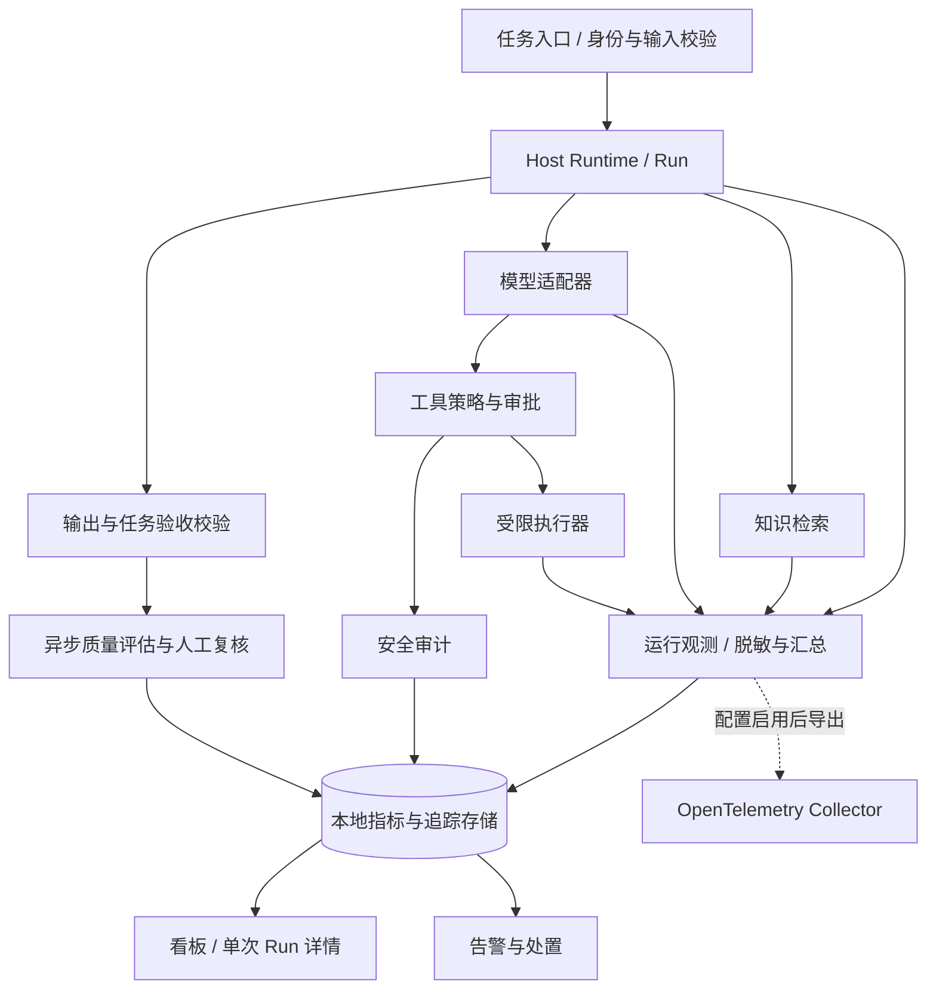

# Antler Agent 生产监控与质量保障方案

> 状态：待评审，待实施  
> 日期：2026-10-10  
> 适用范围：Tauri 本机模式与自托管 Web 模式中的生成、知识问答和工具执行任务  
> 相关文档：[架构规划](./01-architecture-plan.md)、[登录认证规划](./05-login-auth-design.md)、[知识库设计](./07-knowledge-base-design.md)、[Subagent 设计](./08-subagent-design.md)、[环境变量防护](./09-agent-secret-protection.md)

## 1. 目标与总体方案

为 Agent 建立运行监控、质量评估、安全控制和告警处置四个闭环。每一次任务应能回答：

1. 是否正常结束，耗时和成本是多少，瓶颈位于哪个环节？
2. 是否满足任务要求，结论是否有证据支持？
3. 是否发生越权、敏感信息泄露或未经批准的操作？
4. 哪个模型、提示词、技能、知识库或应用版本导致了变化？
5. 发现问题后，应阻断、降级、回滚还是交由人工复核？

以 `Run` 为关联主体，统一连接运行指标、步骤追踪、质量评价、安全审计和用户反馈。运行终态和质量结论分开存储：`succeeded` 只说明执行流程完成，不代表任务验收通过。

本方案描述目标设计，不表示相关能力已经实现。首期沿用现有 TypeScript Backend、Prisma 和 SQLite，先完成本地监控闭环；集中采集作为可配置扩展。本机模式默认不向外部系统上传任务内容。

## 2. 当前基线与缺口

以下现状以当前代码为准；已有设计文档中的规划不作为已实现能力。

| 区域 | 当前能力 | 需要补充 |
|---|---|---|
| Host Runtime | Run 状态、时间戳、取消、事件数量上限 | 全流程 deadline、明确终止原因、轮数/工具/Token 限额 |
| 模型适配器 | 模型调用、原始事件订阅、请求超时 | 单次调用追踪、usage 汇总、错误和重试分类 |
| 事件系统 | 模型步骤、工具开始/结束、知识检索、终态事件 | 稳定步骤 ID、耗时、trace 关联、监控版本 |
| RunStore | Run、事件序号、知识命中快照、重启中断恢复 | 指标摘要、质量评价、安全审计、反馈 |
| SecretGuard | 已知秘密脱敏、敏感文件限制、流式输出脱敏 | 输入持久化保护、个人信息规则、导出和历史数据治理 |
| 工作区工具 | 路径检查、输出限制、命令超时、环境过滤 | 执行前授权、风险审批、操作系统级隔离、出口控制 |
| HTTP | 可选共享 access token | 生产 Web 的身份认证、资源授权、审计主体 |

当前需优先解决的具体问题：

- Run 总超时在知识检索完成后、模型调用前启动，尚不能覆盖完整任务链路。
- 超时和主动取消均经 AbortController 收敛，终态缺少明确原因。
- 模型步骤开始和完成使用事件数量生成 ID，不能可靠配对；工具步骤已有 `toolCallId`。
- 模型消息结束时尚未归集 Token usage；不能仅凭现有领域事件准确核算成本。
- `Run.input` 在执行阶段脱敏之前持久化，新增输出脱敏不自动覆盖原始输入和历史记录。
- Bash 直接启动本机进程；`cwd`、文件名检查和脱敏不构成执行沙箱。
- 已声明 `awaiting_approval` 和审批事件，不意味着写入、网络和系统操作已具备完整审批闭环。

参考代码：[Host Runtime](../backend/src/agent/host-runtime.ts)、[Pi Adapter](../backend/src/agent/pi-agent-adapter.ts)、[工作区工具](../backend/src/agent/workspace-tools.ts)、[RunStore](../backend/src/runs/run-store.ts)、[HTTP Hooks](../backend/src/plugins/http.ts)、[Prisma Schema](../backend/prisma/schema.prisma)。

## 3. 目标架构

运行事件继续服务 SSE 展示和补放；遥测通过独立的有界异步通道汇总，避免监控流量逐条增加 SSE 事件并消耗 `maxEvents` 配额。安全授权在执行前同步完成，关键审计使用可靠存储，不能依赖遥测采样。

采用 OpenTelemetry 作为可选导出协议；模型和工具字段参考其 GenAI 约定，业务验收字段使用 Antler 自有命名。固定所采用的约定版本，将映射集中在适配层，避免字段调整影响业务事件协议。[参考：GenAI Agent spans](https://github.com/open-telemetry/semantic-conventions-genai/blob/main/docs/gen-ai/gen-ai-agent-spans.md)。

## 4. 指标与统计口径

### 4.1 性能、可靠性与资源

| 指标 | 定义与口径 |
|---|---|
| 任务总耗时 | 从服务端接受任务到终态，包含排队、检索、模型、工具及审批等待 |
| 自动执行耗时 | 独立记录自动执行区间，审批等待单独统计；并行步骤不能直接累加为总耗时 |
| 首次可见文本延迟 | 从接受任务到服务端发出首段非空、脱敏后的正文；排除 thinking、工具结果和状态事件 |
| 客户端首次展示延迟 | 客户端另行测量，包含请求、传输与渲染；与服务端指标分开 |
| 检索/模型/工具耗时 | 每次操作独立记录；输出 P50/P95/P99 和样本数 |
| 运行失败率 | 窗口内 `failed` Run 数 / 已进入终态的 Run 数；并列展示各类取消和阻断占比 |
| 超时率 | 终止原因为 timeout 的 Run 数 / 已进入终态的 Run 数 |
| 工具错误率 | 失败调用数 / 已结束工具调用数；策略拒绝单独统计 |
| 模型请求错误率 | 按请求尝试统计，区分限流、连接失败、请求超时和供应商错误 |
| SSE 稳定性 | 连接中断、重连、补放失败分别统计，不直接视为任务失败 |
| 失控信号 | 模型轮数、工具次数、重复调用、无进展持续时间、预算耗尽次数 |
| 服务资源 | CPU、RSS/堆内存、事件循环延迟、活动 Run、DB 写入延迟、磁盘使用和监控队列深度 |

服务端耗时使用单调时钟计算，UTC 时间戳用于关联记录，展示时采用用户时区。无正文输出的任务，其首次文本延迟为空，不写成 0；未结束操作和缺失数据不能混入正常耗时分位数。

增加独立的 `terminationReason`：`completed`、`user_cancelled`、`timeout`、`budget_exceeded`、`policy_blocked`、`provider_error`、`tool_error`、`storage_error`、`interrupted`。保留现有 RunStatus，终止原因补充其语义。一次工具失败后任务仍可能恢复成功，调用错误与 Run 终止原因分别记录。

### 4.2 成本与效率

- 每次模型调用记录供应商返回的输入、输出、缓存 Token，并注明 usage 是否完整；不可获得时标记 unknown。
- Token 汇总按唯一调用标识去重，兼容消息累计 usage；重试调用独立计入可确认的消耗。
- 成本记录币种、价格版本、计价时间、费用来源和完整性。区分供应商结算费用与价格表估算，未知费用不计为免费。
- 单任务展示模型轮数、工具次数、重试和估算成本；评价器的成本单独归集。
- 后续 Subagent 按 `parentRunId` 关联，每个 child 只计入顶层汇总一次；并行耗时按实际时间区间分析。

聚合指标使用场景、模型、工具、版本、错误类别等受控维度。`runId`、`conversationId`、用户输入、文件路径和 URL 不作为时序指标标签；项目级筛选通过授权后的明细查询或受控聚合实现。

### 4.3 准确性与任务质量

| 场景 | 主要验收依据 | 监控指标 |
|---|---|---|
| 结构化生成 | Schema、必填字段、值域和业务约束 | 格式合规率、业务校验通过率 |
| 知识问答 | 引用存在、结论受引用支持、证据充分 | 引用有效率、结论支持率、正确拒答率 |
| 代码生成 | 编译、行为测试、需求验收 | 编译/测试通过率、需求验收通过率 |
| 工具执行 | 文件或目标系统的实际状态 | 执行后条件通过率、错误副作用数 |
| 总结与文案 | 事实一致、要点覆盖、任务要求 | 人工验收率、事实错误率 |

任务验收通过率 = 验收通过的任务数 / 已完成有效评价的任务数。必须同时展示评价覆盖率、样本数、抽样策略和评价器版本；待评价、评价失败与不可判断的任务不默认为通过。跨场景不汇成缺少解释的单一“准确率”。

评价结论分为 `passed`、`failed`、`pending`、`unknown`，另记录评价作业状态和失败原因。某个 Run 可以有多个维度的评价；最终汇总按该场景的验收规则生成。

### 4.4 安全性

分别统计攻击/越权尝试、策略阻断、人工批准、实际违规和事件影响。阻断次数增加可能来自攻击流量增加，不能直接解释为安全性下降。

重点记录：未认证访问、跨项目访问、敏感文件读取、危险写入、未审批执行、凭据或个人信息泄露、网络外传、提示注入和审批绕过。检测能力通过固定攻击集测量漏报和误报，记录规则版本。

## 5. 追踪与数据模型

### 5.1 标识和版本

根 Run 对应一个 trace，检索、每次模型调用、审批和每次工具执行各有独立 span。异步评价通过原 Run 的 trace/run 标识建立关联，不延长已结束 Run 的主链路。

必需元数据包括：

- 标识：`runId`、`traceId`、`spanId`、`stepId`、`toolCallId`，可选 `parentRunId`。
- 场景：任务类型、部署模式、环境和授权主体引用。
- 版本：应用版本、模型标识、prompt 版本/哈希、技能指纹、知识索引版本、策略版本、遥测 schema 版本。
- 结果：开始/结束时间、耗时、状态、错误分类、终止原因、usage 完整性。

工具参数记录脱敏摘要或规范化摘要，不在通用遥测里保留原始秘密。审批校验使用可信存储中的不可变参数快照；不能只依靠脱敏后的可读摘要判断参数是否被替换。

### 5.2 建议持久化实体

以下为逻辑模型，具体 Prisma 字段和迁移在实施阶段确定。

| 实体 | 内容 | 约束 |
|---|---|---|
| Run 扩展 | 场景、traceId、版本快照、终止原因 | 版本在创建时固定；不保存认证凭据 |
| RunMetrics | 总耗时、首段延迟、轮数、工具数、Token、费用、完整性 | 每 Run 一份汇总，重复收尾幂等 |
| RunSpan | 操作 ID、父操作、类别、时间、状态、有限属性 | 唯一操作 ID；支持并行步骤 |
| RunEvaluation | 维度、结论、分数、证据引用、评价器/规则版本 | 支持多次评价，不能覆盖旧结论而失去历史 |
| EvaluationJob | 抽样原因、状态、重试、输入快照引用 | 按 Run/评价器/输入版本去重 |
| SecurityAudit | 主体、Run、动作、资源摘要、决定、规则、审批引用 | 追加写入、受限查询，关键操作可靠记录 |
| RunFeedback | 反馈人、任务、类别、评价和可选备注 | 校验资源权限；备注按内容数据保护 |
| AlertIncident | 规则、严重度、关联 Run、负责人、确认与处置 | 支持去重、状态流转和处置记录 |

SQLite 适用于首期本机或单实例。集中部署的数据量、并发和留存要求超出该形态时，再评估外部存储；不把 SQLite 文件直接作为多实例共享数据库。

## 6. 质量评估与发布门禁

### 6.1 离线评测

建立按场景版本化的评测集，覆盖正常输入、边界输入、多轮任务、证据缺失、依赖失败和攻击样本。标注预期结果、允许的操作、禁止的副作用及验收规则；评测集与开发调优样本区分，防止只对已知样本优化。

模型、提示词、技能、检索、工具策略变化均触发相关回归。与上一稳定版本比较质量、耗时、Token 和安全结果；随机性较强的任务采用重复测量，并报告波动和样本量。

存在写入、发送、发布等副作用的评测或回放，只在隔离工作区、测试账号或模拟工具中执行。不会为了复现故障自动再次执行生产操作。

### 6.2 在线评估

1. 对适用输出全量做确定性校验；需要拦截的规则在交付或产生副作用前执行。
2. 首期对普通低风险任务按场景随机抽样 10% 做异步评价，作为可调整起点。
3. 对高风险任务、用户差评、异常费用和执行后条件失败优先评价；单独报告该样本组，避免混入随机样本造成偏差。
4. 人工复核评价器的通过和失败样本，检查误判、场景偏差和规则漂移。
5. 将复核后的典型失败纳入回归集，保留样本来源和版本。

模型评价器只能提供辅助判断。使用固定 rubric 和版本记录，必要时与人工标注对齐；输入中的指令不能覆盖评价规则。涉及用户内容的外部评价服务须经过明确配置和数据授权。

普通流式任务的事后评价不保证已发送内容正确。需要事前保证的场景，应先缓冲、验证再输出，或在高风险动作前设置验收/审批关口，并计入额外延迟。

### 6.3 发布门禁

发布前要求：关键场景验收达标；安全回归没有未处置的严重违规；性能和成本符合场景预算；评价数据完整。新版本按场景灰度，保留上一稳定版本的配置快照。

门禁阈值由业务负责人、运行负责人和安全负责人共同确认。小样本不足以证明质量稳定；不足时显示“证据不足”，采用人工验收和限制流量，不自动扩大灰度。

## 7. 安全控制与数据治理

### 7.1 执行前控制

- 身份与资源权限：本机模式绑定本地授权范围；Web 模式在任务创建、查询、SSE、取消、监控和导出接口校验认证主体及资源权限。未完成多用户授权前，不宣称多用户隔离。
- 工具分类：按读取、写入、网络、系统操作声明权限与风险；由执行器强制检查，不依赖模型遵循提示词。
- 审批：绑定 Run、工具、实际目标、不可变参数、有效期和审批人；审批后参数改变须重新判断，审批令牌只能消费一次。
- 隔离：Bash 和其他任意代码能力使用受限执行环境，仅挂载授权目录，限制网络出口、CPU、内存、进程和执行时间。未具备隔离时，生产策略禁止开放任意代码工具。
- 预算：创建时固定 deadline、模型轮数、工具次数和 Token 限额；调用前检查剩余额度，执行中传播取消。货币预算使用保守估算或预留，usage 延迟不能被描述为绝对硬上限。
- 提示注入：检索和工具结果视为不可信数据；它们不能赋予额外权限。检测结果辅助审计，授权边界由执行器独立保证。

全流程 deadline 包含检索；审批等待设独立过期时间，同时不能使任务无限存活。检测无进展以可验证进度和资源消耗为依据，不以模型持续输出文本作为唯一进度证据。

### 7.2 内容保护与留存

- 在输入写入 RunStore 前完成内容分类、秘密/个人信息处理；原始执行上下文与可持久化副本分离。外部知识检索的输入也应在发送前满足对应数据策略。
- 默认遥测只采集元数据、计数和必要摘要；不导出 API Key、会话 token、原始请求体、思考文本或工具完整输出。
- 延续 SecretGuard 的秘密脱敏，增加个人信息规则；输出脱敏不能取代权限控制，也不能保证发现全部未知秘密。
- URL 查询参数中的 token、Cookie 和认证 Header 在应用、代理和导出链路中统一排除。
- 原始内容诊断采集默认关闭；启用时限定范围、期限、访问权限和用途，并单独记录操作审计。
- 首期建议元数据和评价记录保留 30 天，获准采集的诊断内容保留 7 天，安全审计保留 90 天；这些是配置起点，不是法定要求，须按部署的数据要求确认。
- 删除任务时按策略清理内容、评价证据和外部副本；有独立保留依据的审计记录仅保留最小信息，并说明范围。备份采用独立到期策略。
- 历史输入与日志需单独扫描、迁移或清理；新的脱敏逻辑不自动修复历史数据。

风险管理与持续评估参考 [NIST 生成式 AI 风险管理指南](https://nvlpubs.nist.gov/nistpubs/ai/NIST.AI.600-1.pdf)。

## 8. 看板与告警处置

### 8.1 看板

1. 运行概览：请求量、活动 Run、终态分布、耗时分位数、首段延迟、资源和依赖状态。
2. 质量看板：按场景展示验收率、评价覆盖率、样本量、评价器版本、人工复核与用户反馈。
3. 安全看板：攻击尝试、阻断、实际违规、审批情况与未处理事件。
4. 成本看板：Token、估算/结算费用、预算耗尽、异常任务和评价开销。
5. Run 详情：步骤时间线、版本快照、知识证据、工具策略、指标、评价及事件关联。

所有看板与导出采用与业务资源一致的访问范围。默认展示摘要，内容证据按权限展开。对于无采集权限、丢失或未评价的数据明确显示 unknown。

### 8.2 告警规则

| 类别 | 首期触发条件 | 处置 |
|---|---|---|
| 严重安全事件 | 任意确认的越权副作用、泄密或审批绕过 | 阻断相关能力，保护证据，通知安全负责人，排查受影响范围 |
| 可用性异常 | 场景失败率或超时率超过批准的 SLO | 检查依赖、限流/降级，必要时回滚 |
| 性能异常 | P95 持续超过场景目标或稳定版本基线 | 定位检索、模型、工具或存储瓶颈 |
| 质量回退 | 有效样本满足要求后，验收率低于发布门槛 | 暂停扩大灰度，人工复核并决定回滚 |
| 预算异常 | 达到 Run 的次数、Token 或时间限制 | 终止或进入显式追加授权流程，记录原因 |
| 观测失效 | 队列积压、导出失败、评价滞后、覆盖率下降 | 通知运行负责人，标记数据不完整 |

一般聚合告警可从连续两个 5 分钟窗口、每窗口至少 30 个相关样本开始试运行；具体 SLO 与质量样本要求按场景确定，不直接作为生产承诺。低流量场景改用更长窗口和单任务规则；严重安全事件不受最小样本限制。

告警按规则、场景和版本去重，支持冷却、升级、维护静默与恢复通知。每个告警包含负责人、关联 Run、版本、样本量、触发证据和处置步骤。

默认只通知和限制扩流；自动模型切换或回滚须事先批准并验证质量、权限与兼容性。对有副作用的工具，超时后先确认实际执行状态，不自动重复调用。

### 8.3 故障处理

事件状态采用 `open → acknowledged → mitigated → resolved`。运行负责人处理可用性和成本，业务负责人处理验收与质量，安全负责人处理违规和证据；个人部署可由同一人承担，但职责仍需明确。

严重事件先止损再定位，保留脱敏后的证据及必要访问审计。处置记录包括原因、影响范围、临时措施、修复版本和回归样本；未经验证的推测不能标记为已确认根因。

## 9. 监控链路的可靠性

- 常规遥测有界排队、批量写入和重试，不使模型流式输出等待远端导出。
- 队列满时优先保留汇总、错误和慢请求元数据，允许丢弃普通追踪；记录丢弃数和完整性，不能静默失败。
- 元数据汇总全量记录；普通详细 trace 可采样。获准范围内的错误、慢任务和安全事件优先保留，不因此额外采集原始内容。
- 关键安全决策与审批审计无法可靠保存时，禁止继续高风险动作；可恢复授权状态不依赖遥测系统。
- 异步评价作业支持幂等、有限重试和失败记录；评价失败不能写成任务质量通过。
- 服务重启为未完成 Run 记录 interrupted；已结束汇总不会因恢复流程重复计费。
- 设置活动 Run、事件、缓存 Agent 和遥测缓冲的容量与回收策略，防止长期运行内存增长。
- 默认采集本机；外部导出必须显式配置，并经过脱敏和权限校验。导出故障不会扩大内容采集范围。

## 10. 实施阶段与验收

### P0：运行可追踪，风险可阻断

交付：

- 稳定步骤 ID、全流程耗时、首段延迟、usage、版本快照和终止原因。
- RunMetrics/RunSpan 最小存储及 Run 详情查询；重启恢复和重复收尾幂等。
- 输入持久化脱敏、工具策略入口、预算限制、关键审计。
- 生产部署认证边界；任意代码工具完成隔离，或在生产配置中禁用。
- 运行概览、单次 Run 详情、基础告警和观测完整性指标。

验收：任意异常任务均能说明失败原因、耗时环节、模型和配置版本、工具执行与策略决定；超时、用户取消、预算耗尽可区分；监控系统不可用不破坏普通任务，高风险审计失效能阻断操作。

### P1：质量可衡量，发布可把关

交付：场景验收规则、离线评测集、确定性输出验证、异步评价、人工复核、用户反馈、质量看板和发布门禁。

验收：质量结果独立于 Run 终态；能展示样本量和覆盖率；评价器误判可复核；新旧版本可比较；生产副作用不会被评测回放重复执行。

### P2：持续运营与集中观测

交付：可配置 OpenTelemetry 导出、灰度对比、依赖分析、成本趋势、告警事件管理；Subagent 实现后接入父子追踪、预算和费用汇总。

验收：能定位版本或场景回退，告警有负责人和处置记录；外部导出遵守内容权限与留存策略；父子费用不重复计算，并行耗时不被错误相加。

实施顺序依赖为 P0 → P1 → P2。每阶段在代码实施前细化任务和估算，不以未确认的日期承诺交付。

## 11. 实施时的验证要求

| 验证项 | 核心案例 |
|---|---|
| 计时与追踪 | 多轮、并行工具、无正文、检索超时、审批等待、稳定步骤配对 |
| usage 与费用 | 重试、累计 usage、缺失 usage、重复消息、价格变更、父子汇总 |
| 取消与预算 | 用户取消、超时、额度耗尽、中断恢复、调用前预留与并发限制 |
| 安全边界 | 路径/符号链接越界、提示注入、参数替换、审批过期与重复消费、网络外传 |
| 数据保护 | 原始输入、跨分片秘密、工具输出、异常、查询 token、导出与历史数据 |
| 评价流程 | 规则通过/失败、评价器失败、抽样偏差、人工纠正、恶意评价输入 |
| 故障注入 | DB 写入失败、导出不可用、磁盘满、队列满、重启、评价积压 |
| 权限 | Run/看板/SSE/反馈/导出的跨资源访问、无认证部署配置 |
| 监控开销 | 启用前后对同一负载比较延迟、内存和写入量，确认满足批准预算 |

代码实施完成后按仓库要求执行 `pnpm check` 和 `pnpm test`，并补充相关行为的回归测试。本次方案文档本身不改变运行行为或数据库。

## 12. 实施前需确定的参数

| 参数 | 建议起点 / 决策方式 |
|---|---|
| 首批场景 | 优先知识问答、代码生成和文件操作，分别定义验收 |
| 部署形态 | 明确本机、自托管单管理员或多用户；认证边界随形态确定 |
| 性能 SLO | 用代表性任务建立基线，再确定首段延迟与总耗时目标 |
| 质量门槛 | 业务负责人按场景确定，通过人工标注验证规则 |
| Run 预算 | 按任务复杂度确定模型轮数、工具次数、Token 和时间 |
| 安全策略 | 指定允许工具、工作区、网络目标、审批与隔离方式 |
| 内容与留存 | 默认不外传原始内容；确认采集、访问、保留和删除范围 |
| 负责人 | 指定运行、质量和安全事件负责人及通知渠道 |

这些参数不妨碍先实现稳定标识、指标采集、脱敏和可靠存储；扩大生产使用范围前须落实场景验收、授权与预算配置。
